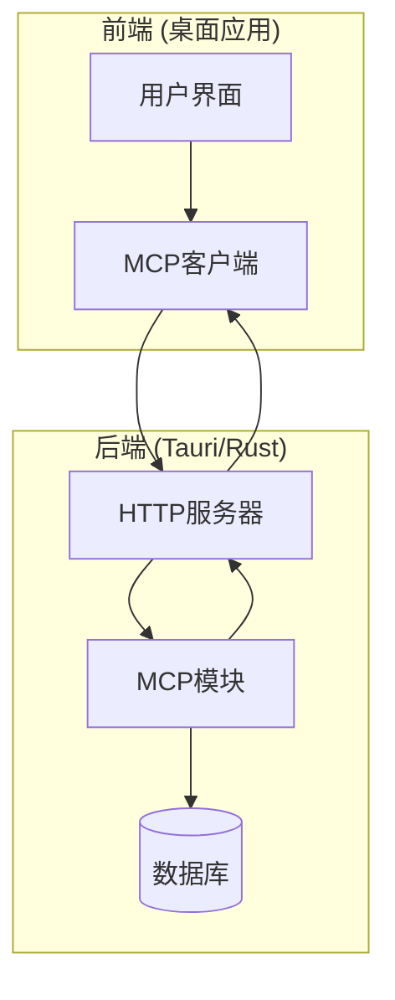
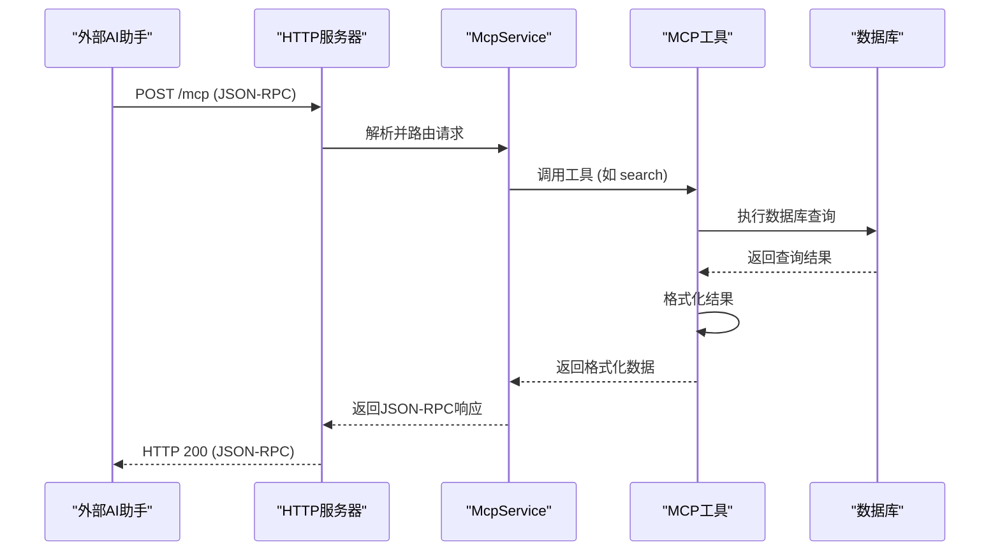
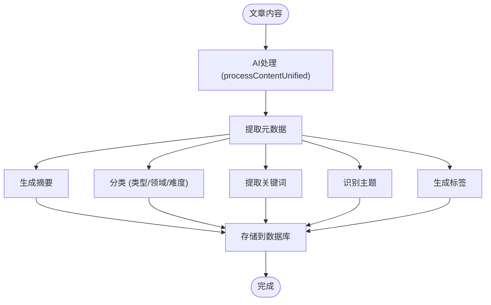
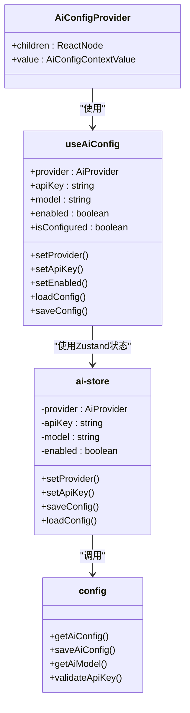

# AI集成（MCP协议）

<cite>
**本文档引用的文件**
- [mcp-implementation-architecture.md](file://docs/implementation-artifacts/mcp-implementation-architecture.md)
- [mcp-connection-issues.md](file://docs/troubleshooting/mcp-connection-issues.md)
- [config.ts](file://packages/ai/src/config.ts)
- [processor.ts](file://packages/ai/src/processor.ts)
- [unified-processor.ts](file://packages/ai/src/unified-processor.ts)
- [ai-store.ts](file://apps/desktop/src/store/ai-store.ts)
- [use-ai-config.ts](file://apps/desktop/src/hooks/use-ai-config.ts)
- [AiConfigProvider.tsx](file://apps/desktop/src/providers/AiConfigProvider.tsx)
- [server/mod.rs](file://apps/desktop/src-tauri/src/server/mod.rs)
- [routes.rs](file://apps/desktop/src-tauri/src/server/routes.rs)
- [ai.ts](file://packages/shared/src/types/ai.ts)
</cite>

## 目录
1. [引言](#引言)
2. [MCP协议集成架构](#mcp协议集成架构)
3. [AI在知识管理中的角色](#ai在知识管理中的角色)
4. [开发者指南](#开发者指南)
5. [优势与限制](#优势与限制)
6. [未来扩展方向](#未来扩展方向)
7. [故障排除](#故障排除)

## 引言

本项目通过Model Context Protocol (MCP) 协议与外部AI助手（如Claude Desktop、Cursor）进行交互，实现了强大的自然语言交互能力。MCP协议作为标准化的通信桥梁，允许AI助手安全地访问本地应用的功能和数据，从而为用户提供更智能、更流畅的体验。本文档详细介绍了MCP协议在此项目中的具体实现方式，包括API端点暴露、请求响应处理，以及AI在知识管理中的核心作用。

**本文档引用的文件**
- [mcp-implementation-architecture.md](file://docs/implementation-artifacts/mcp-implementation-architecture.md)

## MCP协议集成架构

### 核心设计原则

项目的MCP实现遵循模块化、自包含的设计原则，确保了高内聚和低耦合。核心目标是将MCP服务集成到现有的HTTP服务器中，复用现有基础设施，避免重复开发。

- **模块化设计**：MCP功能被封装在独立的`server/mcp/`模块中，职责清晰。
- **自包含**：每个MCP工具（如`search`）都包含完整的实现逻辑。
- **最小化依赖**：直接复用现有的`AppState`、数据库连接和API处理逻辑。
- **渐进式集成**：通过分阶段实施，确保每一步都可独立验证。

### API端点暴露

MCP服务通过一个单一的HTTP端点`/mcp`对外暴露，该端点采用Streamable HTTP传输方式，支持JSON-RPC 2.0协议。

- **端点路径**：`http://127.0.0.1:21890/mcp`
- **传输方式**：Streamable HTTP
- **内容类型**：`application/json`

该端点由Rust后端的Tauri框架提供支持，并通过Axum路由系统进行集成。



**图表来源**
- [server/mod.rs](file://apps/desktop/src-tauri/src/server/mod.rs#L1-L143)
- [routes.rs](file://apps/desktop/src-tauri/src/server/routes.rs#L1-L57)

**本节来源**
- [mcp-implementation-architecture.md](file://docs/implementation-artifacts/mcp-implementation-architecture.md#L1-L871)

### 请求与响应处理流程

当外部AI助手向`/mcp`端点发送请求时，系统会经历以下处理流程：

1.  **请求接收**：HTTP服务器接收到POST请求。
2.  **协议解析**：`transport.rs`模块将HTTP请求体解析为标准的MCP JSON-RPC消息。
3.  **服务路由**：`McpService`根据消息的`method`字段（如`initialize`、`tools/call`）将请求路由到相应的处理函数。
4.  **工具执行**：对于`tools/call`请求，`McpService`会调用具体的工具实例（如`SearchTool`）。
5.  **数据访问**：工具通过`AppState`访问数据库，执行查询或操作。
6.  **结果格式化**：工具将原始数据格式化为AI友好的、易于阅读的文本。
7.  **响应生成**：`McpService`将处理结果封装成JSON-RPC响应。
8.  **返回响应**：`transport.rs`将响应通过HTTP返回给AI助手。



**图表来源**
- [mcp-implementation-architecture.md](file://docs/implementation-artifacts/mcp-implementation-architecture.md#L1-L871)
- [server/mod.rs](file://apps/desktop/src-tauri/src/server/mod.rs#L1-L143)

**本节来源**
- [mcp-implementation-architecture.md](file://docs/implementation-artifacts/mcp-implementation-architecture.md#L1-L871)

## AI在知识管理中的角色

AI在本项目中扮演着知识管理的核心角色，通过自动化处理，极大地提升了信息的组织、检索和理解效率。

### 内容摘要与语义理解

AI能够对用户收藏的文章内容进行深度分析，生成高质量的摘要，并理解其语义特征。

- **摘要生成**：使用`gpt-4o-mini`等大模型，为文章生成100-200字的精炼摘要。
- **语义分类**：自动识别文章的`contentType`（如教程、文档、新闻）、`domain`（如前端、AI）和`difficulty`（如初级、高级）。
- **语言识别**：判断文章的主要语言（中文、英文或混合）。

这些元数据被存储在本地数据库中，为后续的智能搜索和组织提供基础。

### 生成式搜索

项目实现了强大的生成式搜索功能，AI不仅能在语义层面理解用户的查询意图，还能生成新的内容。

- **自然语言解析**：`SearchTool`具备解析自然语言指令的能力。例如，用户输入“搜索 react 收藏夹”，系统能自动解析出搜索关键词“react”和收藏夹筛选条件“react”。
- **语义搜索**：利用嵌入（Embedding）技术，将查询和文档都转换为向量，通过计算向量相似度来找到最相关的内容，超越了传统的关键词匹配。
- **结果聚合**：将搜索结果以清晰、易读的格式呈现，例如：“找到 5 条与"react"相关的内容：1. [React Hooks 指南](https://example.com/react-hooks) (相似度: 95%)”。

### 标签与主题提取

AI可以自动为文章提取关键词、主题和标签，实现智能化的内容组织。

- **关键词提取**：使用AI模型识别文章中的核心关键词，并赋予重要性权重。
- **主题建模**：识别文章讨论的核心主题，帮助用户快速把握内容要点。
- **智能标签**：根据文章内容自动生成分类标签（如`react`、`hooks`、`tutorial`），并支持与用户已有标签风格保持一致。



**图表来源**
- [unified-processor.ts](file://packages/ai/src/unified-processor.ts#L1-L163)
- [processor.ts](file://packages/ai/src/processor.ts#L1-L82)

**本节来源**
- [unified-processor.ts](file://packages/ai/src/unified-processor.ts#L1-L163)
- [processor.ts](file://packages/ai/src/processor.ts#L1-L82)
- [ai.ts](file://packages/shared/src/types/ai.ts#L1-L53)

## 开发者指南

### 配置AI服务

开发者可以通过应用的设置界面配置AI服务，支持多种主流AI提供商。

1.  **选择提供商**：在设置中选择AI提供商（如OpenAI、Anthropic、DeepSeek）。
2.  **输入API密钥**：提供相应的API密钥。
3.  **选择模型**：指定要使用的模型（如`gpt-4o-mini`、`claude-3-haiku-20240307`）。
4.  **启用AI功能**：开启AI功能开关。

配置信息通过`AiConfigProvider`和`useAiConfig`等React Hook在前端管理，并通过Tauri的`invoke`命令安全地存储在后端。



**图表来源**
- [AiConfigProvider.tsx](file://apps/desktop/src/providers/AiConfigProvider.tsx#L1-L32)
- [use-ai-config.ts](file://apps/desktop/src/hooks/use-ai-config.ts#L1-L48)
- [ai-store.ts](file://apps/desktop/src/store/ai-store.ts#L1-L160)
- [config.ts](file://packages/ai/src/config.ts#L1-L184)

**本节来源**
- [config.ts](file://packages/ai/src/config.ts#L1-L184)
- [ai-store.ts](file://apps/desktop/src/store/ai-store.ts#L1-L160)
- [use-ai-config.ts](file://apps/desktop/src/hooks/use-ai-config.ts#L1-L48)
- [AiConfigProvider.tsx](file://apps/desktop/src/providers/AiConfigProvider.tsx#L1-L32)

### 连接外部AI助手

要将本项目连接到外部AI助手（如Cursor），开发者需要在AI助手中进行简单配置。

1.  **确保桌面应用运行**：启动Memory Prosthetic桌面应用，其内置的HTTP服务器会自动启动。
2.  **配置MCP服务器**：在AI助手的设置中，添加一个新的MCP服务器。
    - **名称**：例如 `memory-prosthetic`
    - **URL**：`http://127.0.0.1:21890/mcp`
3.  **重启AI助手**：配置完成后，重启AI助手以加载新的MCP服务器。

### 实现新的MCP工具

开发者可以遵循现有模式，为项目添加新的MCP工具。

1.  **定义工具**：在`tools.rs`中创建新的工具结构体（如`CreateCollectionTool`）。
2.  **实现逻辑**：编写`execute`方法，调用现有的数据库Repository或API handler。
3.  **注册工具**：在`McpService`的`handle_list_tools`和`handle_call_tool`方法中注册新工具。
4.  **更新文档**：完善MCP工具的详细设计文档。

## 优势与限制

### 优势

- **增强的自然语言交互**：用户可以使用自然语言与本地知识库进行交互，极大地降低了使用门槛。
- **无缝集成**：与主流AI开发工具（如Cursor）无缝集成，提升开发效率。
- **智能化知识管理**：AI自动完成摘要、分类、打标签等繁琐任务，让知识组织更高效。
- **本地化与隐私**：所有数据处理都在本地完成，确保了用户数据的隐私和安全。
- **模块化设计**：清晰的架构使得功能扩展和维护变得简单。

### 限制

- **本地运行依赖**：MCP服务依赖于桌面应用的运行，如果应用未启动，AI助手将无法连接。
- **网络配置**：默认仅支持`localhost`连接，不支持远程访问或HTTPS，限制了跨设备使用。
- **功能范围**：当前MCP工具主要集中在数据查询（搜索、列表），缺少数据修改（创建、更新、删除）功能。
- **认证机制**：缺乏API Key等认证机制，在多用户或远程场景下存在安全风险。

## 未来扩展方向

### 短期扩展 (Post-MVP)

- **更多MCP工具**：实现内容收集、标签管理、文章管理等工具，支持更全面的读写操作。
- **增强自然语言解析**：引入更智能的意图识别和实体提取，支持更复杂的查询组合。
- **MCP资源（Resources）**：提供知识库资源列表，支持AI直接访问和引用本地文档。
- **性能优化**：引入请求缓存和连接池管理，提升响应速度。

### 长期扩展

- **认证和授权**：实现API Key或OAuth认证，支持多用户和安全的远程访问。
- **跨平台支持**：支持HTTPS和非localhost连接，允许在不同设备间共享知识库。
- **AI代理工作流**：与项目中的`_bmad/`工作流系统结合，创建由AI驱动的自动化任务。

## 故障排除

### MCP连接问题

当AI助手显示“Loading”状态时，可按以下步骤排查：

1.  **确认桌面应用正在运行**：确保Memory Prosthetic桌面应用已启动。
2.  **测试健康检查端点**：
    ```bash
    curl http://127.0.0.1:21890/api/health
    ```
    应返回 `{"status":"ok","version":"0.1.0"}`。
3.  **测试MCP端点**：
    ```bash
    curl -X POST http://127.0.0.1:21890/mcp -H "Content-Type: application/json" -d '{"jsonrpc": "2.0", "id": 1, "method": "initialize", "params": {}}'
    ```
    应返回包含`capabilities`的初始化响应。
4.  **检查AI助手配置**：确认`~/.cursor/mcp.json`中的URL配置正确。
5.  **查看日志**：检查应用日志（`~/Library/Logs/memory-prosthetic/`）和AI助手日志，寻找错误信息。

**本节来源**
- [mcp-connection-issues.md](file://docs/troubleshooting/mcp-connection-issues.md#L1-L181)