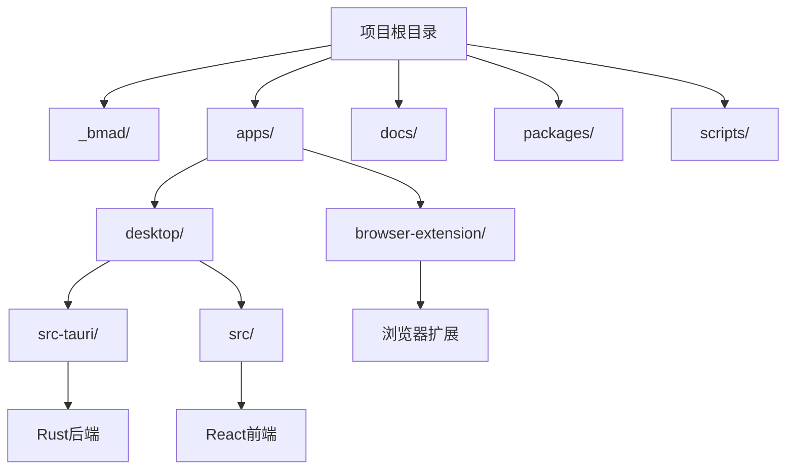
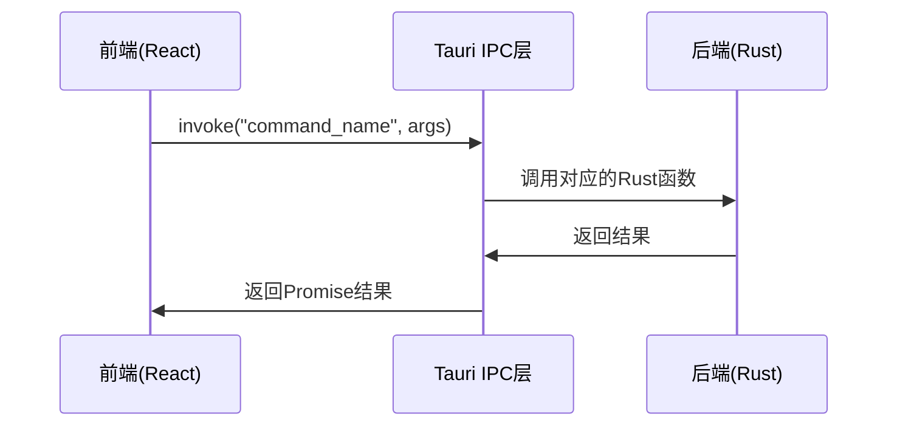
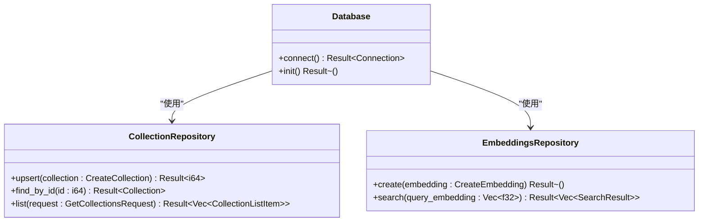
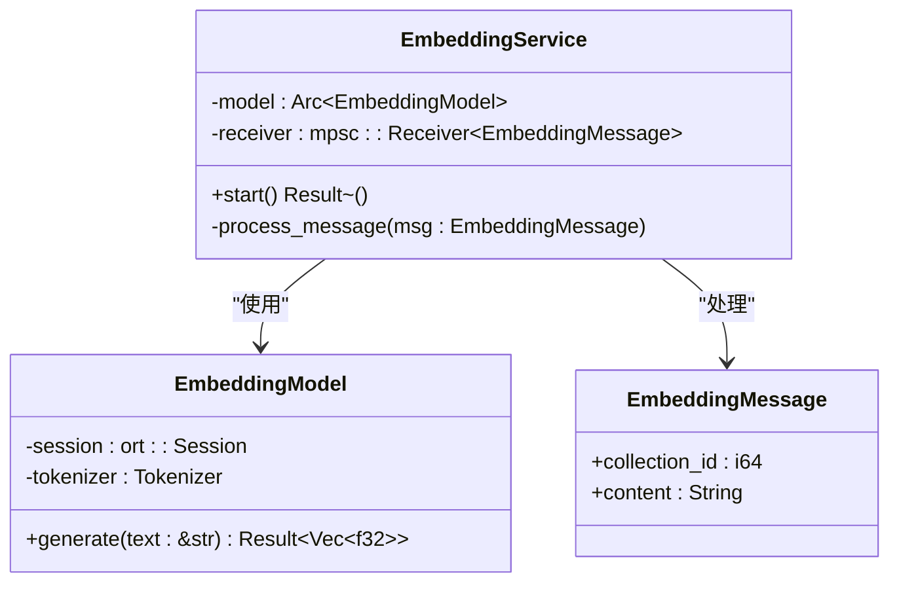
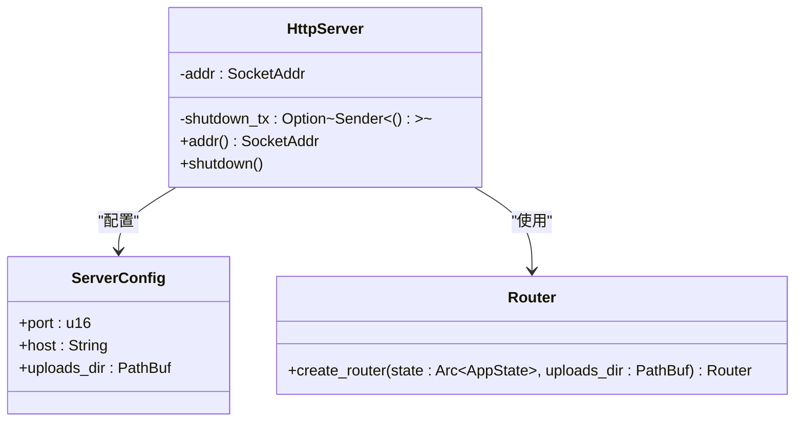
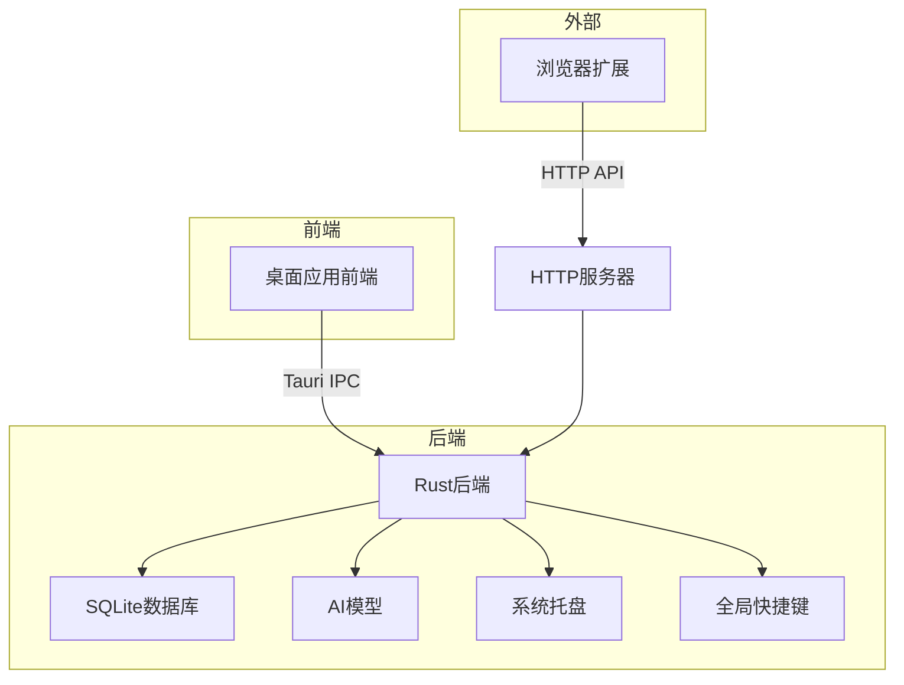

# 技术架构

<cite>
**本文档中引用的文件**  
- [Cargo.toml](file://apps/desktop/src-tauri/Cargo.toml)
- [tauri.conf.json](file://apps/desktop/src-tauri/tauri.conf.json)
- [package.json](file://apps/desktop/package.json)
- [lib.rs](file://apps/desktop/src-tauri/src/lib.rs)
- [main.rs](file://apps/desktop/src-tauri/src/main.rs)
- [main.tsx](file://apps/desktop/src/main.tsx)
- [index.ts](file://apps/desktop/src/apis/index.ts)
- [mod.rs](file://apps/desktop/src-tauri/src/db/mod.rs)
- [mod.rs](file://apps/desktop/src-tauri/src/embedding/mod.rs)
- [mod.rs](file://apps/desktop/src-tauri/src/server/mod.rs)
- [index.ts](file://packages/shared/src/request/index.ts)
- [wxt.config.ts](file://apps/browser-extension/wxt.config.ts)
</cite>

## 目录
1. [项目结构](#项目结构)
2. [前后端分离架构](#前后端分离架构)
3. [Tauri框架与IPC通信](#tauri框架与ipc通信)
4. [核心组件分析](#核心组件分析)
5. [系统架构图](#系统架构图)
6. [技术选型原因](#技术选型原因)
7. [可扩展性与安全性考虑](#可扩展性与安全性考虑)

## 项目结构

该项目采用模块化架构，主要分为以下几个部分：
- `_bmad/`: 包含配置文件和工作流定义
- `apps/`: 应用程序主目录，包含桌面应用和浏览器扩展
- `docs/`: 文档目录
- `packages/`: 共享组件包
- `scripts/`: 构建和测试脚本

桌面应用程序是基于Tauri框架构建的，前端使用React，后端使用Rust。浏览器扩展使用WXT框架开发。

**图源**  
- [tauri.conf.json](file://apps/desktop/src-tauri/tauri.conf.json)
- [package.json](file://apps/desktop/package.json)

## 前后端分离架构

该项目采用了典型的前后端分离架构模式。前端负责用户界面展示和交互，后端处理核心业务逻辑和数据存储。

前端使用React框架构建用户界面，通过TypeScript编写组件。前端代码位于`apps/desktop/src`目录下，使用Vite作为构建工具。前端通过Tauri提供的IPC机制与Rust后端进行通信。

后端使用Rust语言实现，位于`apps/desktop/src-tauri/src`目录下。Rust后端负责数据库操作、AI模型处理、HTTP服务器管理等核心功能。后端通过Tauri命令暴露API给前端调用。

这种架构模式的优势包括：
- 前后端职责分离，便于团队协作开发
- 前端可以专注于用户体验和界面设计
- 后端可以专注于性能优化和数据安全
- 技术栈选择更加灵活

**本节来源**  
- [main.tsx](file://apps/desktop/src/main.tsx)
- [lib.rs](file://apps/desktop/src-tauri/src/lib.rs)

## Tauri框架与IPC通信

Tauri框架作为前后端之间的桥梁，通过进程间通信（IPC）连接前端和后端。Tauri允许开发者使用任何前端框架构建用户界面，同时使用Rust编写安全、高性能的后端逻辑。

在本项目中，Tauri的配置文件`tauri.conf.json`定义了应用程序的基本信息、构建配置和窗口设置。前端通过`@tauri-apps/api`包提供的`invoke`函数调用后端命令，实现IPC通信。

前端通过`@memory-prosthetic/shared`包中的`createTauriAdapter`创建Tauri适配器，然后使用该适配器创建API实例。这种方式封装了底层的IPC调用细节，使前端代码更加简洁和易于维护。

**本节来源**  
- [tauri.conf.json](file://apps/desktop/src-tauri/tauri.conf.json)
- [index.ts](file://apps/desktop/src/apis/index.ts)
- [index.ts](file://packages/shared/src/request/index.ts)

## 核心组件分析

### 数据库组件

数据库组件使用Rusqlite库与SQLite数据库进行交互。`db/mod.rs`文件定义了数据库连接、迁移和各种仓库（Repository）的接口。数据库模式包括收藏（Collection）、标签（Tag）、收藏夹（Favorite）等实体。

数据库操作通过Repository模式封装，提供了类型安全的CRUD操作。例如，`CollectionRepository`负责管理收藏项的创建、更新和查询。

**图源**  
- [mod.rs](file://apps/desktop/src-tauri/src/db/mod.rs)
- [Cargo.toml](file://apps/desktop/src-tauri/Cargo.toml)

### 嵌入式AI组件

嵌入式AI组件使用ONNX Runtime运行all-MiniLM-L6-v2模型生成384维的句子嵌入向量。`embedding/mod.rs`文件定义了嵌入服务、模型管理和文本预处理功能。

嵌入服务在后台运行，自动为新创建的收藏项生成嵌入向量。这些向量用于语义搜索和知识图谱构建。

**图源**  
- [mod.rs](file://apps/desktop/src-tauri/src/embedding/mod.rs)
- [Cargo.toml](file://apps/desktop/src-tauri/Cargo.toml)

### HTTP服务器组件

HTTP服务器组件使用Axum框架创建REST API，供浏览器扩展与桌面应用通信。`server/mod.rs`文件定义了路由、处理器和服务器生命周期管理。

服务器监听本地回环地址的21890端口，提供收集网页内容、搜索等功能的API端点。CORS策略配置为允许任何来源，以便浏览器扩展可以访问。

**图源**  
- [mod.rs](file://apps/desktop/src-tauri/src/server/mod.rs)
- [Cargo.toml](file://apps/desktop/src-tauri/Cargo.toml)

## 系统架构图

该架构图展示了系统的主要组件及其相互关系。浏览器扩展通过HTTP API与桌面应用通信，桌面应用的前端通过Tauri IPC与Rust后端通信。Rust后端负责协调数据库操作、AI模型处理、系统集成等功能。

**图源**  
- [tauri.conf.json](file://apps/desktop/src-tauri/tauri.conf.json)
- [lib.rs](file://apps/desktop/src-tauri/src/lib.rs)
- [main.tsx](file://apps/desktop/src/main.tsx)

## 技术选型原因

### 选择Rust的原因

选择Rust作为后端开发语言主要基于以下几点考虑：

1. **性能优势**：Rust编译为原生代码，执行效率高，适合处理大量数据和复杂计算。
2. **内存安全**：Rust的所有权系统和借用检查器可以在编译时消除许多常见的内存错误，提高软件可靠性。
3. **并发安全**：Rust的类型系统确保数据竞争在编译时就被检测到，简化了并发编程。
4. **生态系统**：Rust拥有丰富的库生态系统，如Tokio异步运行时、Axum Web框架等，适合构建高性能服务。

### 选择SQLite的原因

SQLite作为嵌入式数据库被选用，原因如下：

1. **零配置**：SQLite是一个文件数据库，无需单独的数据库服务器，简化了部署。
2. **可靠性**：SQLite经过充分测试，具有很高的稳定性和数据完整性保证。
3. **性能**：对于单用户应用，SQLite的性能通常优于客户端-服务器数据库。
4. **跨平台**：SQLite支持所有主要操作系统，便于应用的跨平台分发。

### 选择sqlite-vec的原因

sqlite-vec用于本地向量搜索，其优势包括：

1. **本地化**：所有数据和计算都在本地完成，保护用户隐私。
2. **集成性**：作为SQLite的扩展，与现有数据库无缝集成。
3. **效率**：针对向量搜索优化，提供快速的相似性搜索能力。
4. **轻量级**：不需要额外的向量数据库服务，减少系统复杂性。

**本节来源**  
- [Cargo.toml](file://apps/desktop/src-tauri/Cargo.toml)
- [tauri.conf.json](file://apps/desktop/src-tauri/tauri.conf.json)

## 可扩展性与安全性考虑

### 可扩展性设计

系统在设计时充分考虑了可扩展性：

1. **模块化架构**：前后端分离，各组件职责明确，便于独立开发和测试。
2. **插件系统**：Tauri支持插件机制，可以方便地添加新功能。
3. **API设计**：HTTP服务器提供RESTful API，便于与其他服务集成。
4. **配置管理**：通过配置文件和环境变量控制应用行为，适应不同部署场景。

### 安全性考虑

系统在安全性方面采取了多项措施：

1. **数据本地存储**：所有用户数据存储在本地SQLite数据库中，不上传到云端，保护用户隐私。
2. **进程隔离**：Tauri框架确保前端JavaScript代码与后端Rust代码在不同进程中运行，减少攻击面。
3. **输入验证**：对所有外部输入进行严格验证，防止注入攻击。
4. **权限控制**：Tauri配置文件明确声明所需权限，遵循最小权限原则。
5. **HTTPS支持**：虽然当前使用HTTP，但架构支持升级到HTTPS以增强通信安全。

**本节来源**  
- [tauri.conf.json](file://apps/desktop/src-tauri/tauri.conf.json)
- [Cargo.toml](file://apps/desktop/src-tauri/Cargo.toml)
- [lib.rs](file://apps/desktop/src-tauri/src/lib.rs)