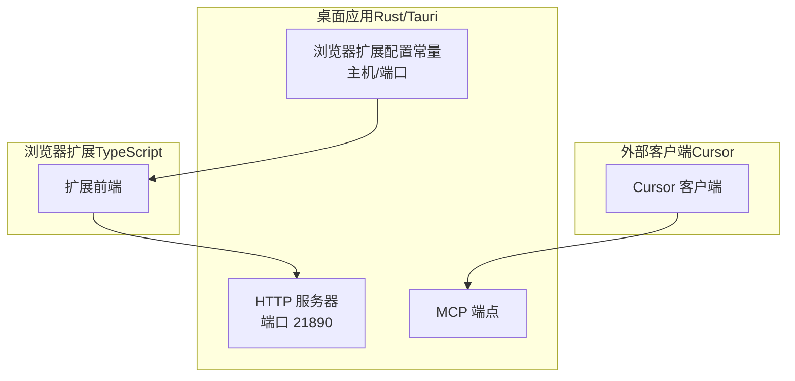
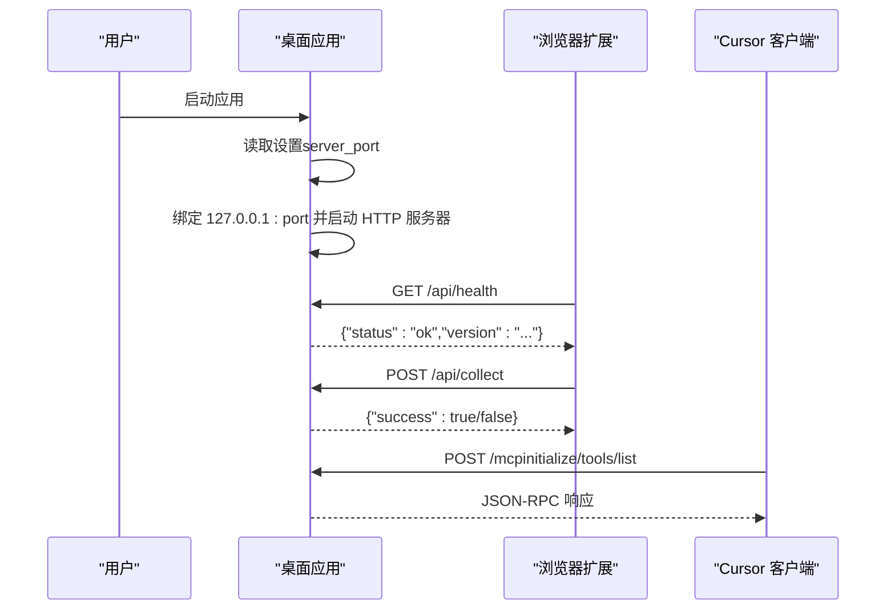
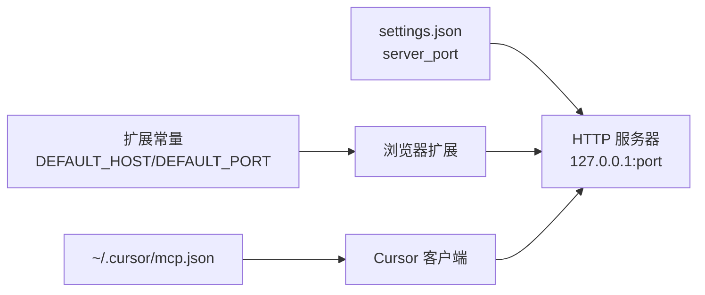

# 故障排除

<cite>
**本文引用的文件**
- [docs/troubleshooting/mcp-connection-issues.md](file://docs/troubleshooting/mcp-connection-issues.md)
- [docs/troubleshooting/server-port-and-proxy.md](file://docs/troubleshooting/server-port-and-proxy.md)
- [docs/troubleshooting/log-location.md](file://docs/troubleshooting/log-location.md)
- [scripts/check-mcp.sh](file://scripts/check-mcp.sh)
- [scripts/check-http-server.sh](file://scripts/check-http-server.sh)
- [scripts/view-logs.sh](file://scripts/view-logs.sh)
- [scripts/test-mcp.sh](file://scripts/test-mcp.sh)
- [apps/desktop/src-tauri/src/server/mod.rs](file://apps/desktop/src-tauri/src/server/mod.rs)
- [apps/desktop/src-tauri/src/settings.rs](file://apps/desktop/src-tauri/src/settings.rs)
- [apps/browser-extension/src/constants/api.ts](file://apps/browser-extension/src/constants/api.ts)
- [docs/analysis/first-launch-errors.md](file://docs/analysis/first-launch-errors.md)
</cite>

## 目录
1. [简介](#简介)
2. [项目结构与入口](#项目结构与入口)
3. [核心组件与职责](#核心组件与职责)
4. [架构总览](#架构总览)
5. [详细问题分类与排障步骤](#详细问题分类与排障步骤)
6. [依赖关系与集成点](#依赖关系与集成点)
7. [性能与稳定性考量](#性能与稳定性考量)
8. [日志查看与解读](#日志查看与解读)
9. [结论](#结论)
10. [附录：常用诊断脚本与端点](#附录常用诊断脚本与端点)

## 简介
本指南面向用户与开发者，系统化梳理使用过程中常见的问题类别，包括 MCP 连接失败、服务器端口冲突、浏览器扩展无法通信、首次启动错误等。针对每类问题，提供症状描述、可能原因、分步解决方案，并结合项目内置的诊断脚本（如 check-mcp.sh、check-http-server.sh、view-logs.sh）与日志查看方法，帮助快速定位与解决问题，降低支持请求量。

## 项目结构与入口
- 桌面应用（Tauri/Rust）提供 HTTP 服务与 MCP 端点，负责与浏览器扩展和外部客户端通信。
- 浏览器扩展（TypeScript）通过固定主机与端口向桌面应用发起请求。
- 诊断脚本位于 scripts/ 目录，覆盖 MCP、HTTP 服务器、日志查看等场景。

图表来源
- [apps/desktop/src-tauri/src/server/mod.rs](file://apps/desktop/src-tauri/src/server/mod.rs#L21-L40)
- [apps/browser-extension/src/constants/api.ts](file://apps/browser-extension/src/constants/api.ts#L1-L24)

章节来源
- [apps/desktop/src-tauri/src/server/mod.rs](file://apps/desktop/src-tauri/src/server/mod.rs#L21-L40)
- [apps/browser-extension/src/constants/api.ts](file://apps/browser-extension/src/constants/api.ts#L1-L24)

## 核心组件与职责
- HTTP 服务器：提供 /api/health、/api/collect 等 REST 接口，以及 /mcp 的 MCP 端点。
- 设置管理：读取/写入应用设置，包含 server_port 等关键参数。
- 浏览器扩展常量：定义默认主机与端口，用于构造 API 基础 URL。
- 诊断脚本：自动化检查桌面应用进程、端口监听、健康检查、MCP 初始化与工具列表、浏览器扩展端点，以及日志查看。

章节来源
- [apps/desktop/src-tauri/src/server/mod.rs](file://apps/desktop/src-tauri/src/server/mod.rs#L21-L40)
- [apps/desktop/src-tauri/src/settings.rs](file://apps/desktop/src-tauri/src/settings.rs#L118-L146)
- [apps/browser-extension/src/constants/api.ts](file://apps/browser-extension/src/constants/api.ts#L1-L24)
- [scripts/check-http-server.sh](file://scripts/check-http-server.sh#L1-L125)
- [scripts/check-mcp.sh](file://scripts/check-mcp.sh#L1-L120)
- [scripts/view-logs.sh](file://scripts/view-logs.sh#L1-L50)

## 架构总览
桌面应用启动时根据设置读取 server_port，默认 21890；服务器绑定 127.0.0.1:port 并开启 CORS，允许浏览器扩展访问。浏览器扩展与外部客户端（如 Cursor）均通过 http://127.0.0.1:port 访问接口。

图表来源
- [apps/desktop/src-tauri/src/server/mod.rs](file://apps/desktop/src-tauri/src/server/mod.rs#L63-L109)
- [apps/desktop/src-tauri/src/settings.rs](file://apps/desktop/src-tauri/src/settings.rs#L118-L146)
- [apps/browser-extension/src/constants/api.ts](file://apps/browser-extension/src/constants/api.ts#L1-L24)

## 详细问题分类与排障步骤

### 一、MCP 连接失败（Loading 状态）
症状
- Cursor 显示“Loading”，无法获取工具列表或初始化失败。

可能原因
- 桌面应用未运行或 HTTP 服务器未启动
- 端口被占用或配置错误（默认 21890）
- MCP 协议实现不兼容或响应格式异常
- Cursor 配置文件（~/.cursor/mcp.json）不正确

排查步骤
1. 确认桌面应用正在运行
   - 使用进程名过滤检查应用进程是否存在
   - 检查端口 21890 是否处于监听状态
2. 测试健康检查端点
   - 访问 http://127.0.0.1:21890/api/health，应返回状态为 ok
3. 测试 MCP initialize
   - 发送 JSON-RPC initialize 请求，应返回 protocolVersion 与 serverInfo
4. 测试 tools/list
   - 发送 JSON-RPC tools/list 请求，应返回工具列表（至少包含 search、list_collections、list_tags、list_favorites）
5. 检查 Cursor 配置
   - 确认 ~/.cursor/mcp.json 中 memory-prosthetic 项指向 http://127.0.0.1:21890/mcp

常见解决
- 连接被拒绝：启动桌面应用，查看日志确认 HTTP 服务器已启动
- 超时：检查防火墙与端口占用，必要时更改端口
- 协议错误：升级应用至最新版本，查看日志中的 MCP 相关错误，重启应用

验证清单
- 桌面应用正在运行
- HTTP 服务器已启动（端口 21890）
- /api/health 可访问
- /mcp 可访问
- initialize 返回正确响应
- tools/list 返回工具列表
- Cursor 配置正确
- 无防火墙阻止

下一步
- 重启 Cursor
- 在 Cursor 设置中禁用并重新启用 MCP 服务器
- 检查 Cursor 版本（建议 0.47+）
- 查看 Cursor 日志（位置：~/Library/Logs/Cursor/ 或 ~/.cursor/logs/）

章节来源
- [docs/troubleshooting/mcp-connection-issues.md](file://docs/troubleshooting/mcp-connection-issues.md#L1-L181)
- [scripts/check-mcp.sh](file://scripts/check-mcp.sh#L1-L120)
- [scripts/test-mcp.sh](file://scripts/test-mcp.sh#L1-L42)

### 二、服务器端口冲突与代理影响
症状
- 浏览器扩展或 MCP 无法连接
- curl 报错（Connection refused、Timeout）

可能原因
- 端口 21890 被占用
- 代理配置影响本地连接（尤其是 localhost 解析）
- 设置文件中的 server_port 与实际监听不一致

排查步骤
1. 检查端口占用
   - 使用 lsof -i :21890 检查占用情况
2. 修改端口（推荐通过设置文件）
   - 手动编辑应用设置文件中的 server_port 字段
   - 重启应用后生效
3. 使用 127.0.0.1 而非 localhost
   - 应用已固定使用 127.0.0.1，通常不受系统代理影响
4. 临时禁用代理或配置 no_proxy
   - unset http_proxy https_proxy
   - export no_proxy="127.0.0.1,localhost"

验证配置
- 运行 ./scripts/check-http-server.sh 自动检查应用运行、端口监听、健康检查、MCP 端点与浏览器扩展端点

章节来源
- [docs/troubleshooting/server-port-and-proxy.md](file://docs/troubleshooting/server-port-and-proxy.md#L1-L220)
- [scripts/check-http-server.sh](file://scripts/check-http-server.sh#L1-L125)
- [apps/desktop/src-tauri/src/server/mod.rs](file://apps/desktop/src-tauri/src/server/mod.rs#L21-L40)
- [apps/desktop/src-tauri/src/settings.rs](file://apps/desktop/src-tauri/src/settings.rs#L118-L146)
- [apps/browser-extension/src/constants/api.ts](file://apps/browser-extension/src/constants/api.ts#L1-L24)

### 三、浏览器扩展无法通信
症状
- 扩展弹窗或按钮无响应
- /api/collect 返回非 200 或失败

可能原因
- 桌面应用未运行或端口不正确
- 扩展配置与实际端口不一致
- 防火墙或代理阻止本地连接

排查步骤
1. 确认桌面应用运行且端口监听
2. 使用脚本 ./scripts/check-http-server.sh 检查 /api/collect
3. 检查扩展配置常量（DEFAULT_HOST/DEFAULT_PORT）
4. 如需变更端口，同步更新扩展配置与 MCP 配置

章节来源
- [scripts/check-http-server.sh](file://scripts/check-http-server.sh#L89-L110)
- [apps/browser-extension/src/constants/api.ts](file://apps/browser-extension/src/constants/api.ts#L1-L24)

### 四、首次启动错误（应用崩溃或无法启动）
症状
- 应用启动即崩溃或黑屏无响应

可能原因
- 应用数据目录获取失败
- 数据库初始化失败（目录创建、文件创建、WAL 模式、迁移）
- 设置文件初始化失败（JSON 格式错误、文件读取失败）
- Tokio Runtime 创建失败

排查步骤
1. 查看系统日志（macOS 控制台或 log stream），搜索包含 desktop 的错误与警告
2. 检查应用数据目录 ~/Library/Application Support/com.memory-prosthetic.desktop/ 是否存在
3. 检查 settings.json 是否存在且 JSON 格式正确
4. 检查磁盘空间与权限
5. 若设置文件损坏，系统会自动备份为 settings.json.bak 并使用默认设置继续启动

章节来源
- [docs/analysis/first-launch-errors.md](file://docs/analysis/first-launch-errors.md#L1-L377)
- [docs/troubleshooting/log-location.md](file://docs/troubleshooting/log-location.md#L1-L137)

### 五、日志位置与查看方法
- 开发模式：控制台输出
- 发布模式：macOS 系统日志
- 建议：添加日志文件功能（应用数据目录下的 logs/ 目录，支持轮转）

快速查看
- 打开 Console.app，搜索应用名称（如 Memory Prosthetic 或 desktop）
- 使用 log show/log stream 命令筛选进程与时间范围
- 使用 ./scripts/view-logs.sh 快速查看应用数据目录、系统日志与崩溃报告

章节来源
- [docs/troubleshooting/log-location.md](file://docs/troubleshooting/log-location.md#L1-L137)
- [scripts/view-logs.sh](file://scripts/view-logs.sh#L1-L50)

## 依赖关系与集成点
- 桌面应用依赖设置文件决定 server_port；服务器绑定 127.0.0.1:port 并开启 CORS
- 浏览器扩展通过常量 DEFAULT_HOST/DEFAULT_PORT 构造 API 基础 URL
- 外部客户端（Cursor）通过 ~/.cursor/mcp.json 指向 /mcp 端点
- 诊断脚本统一调用 curl 与 lsof，辅助自动化排障

图表来源
- [apps/desktop/src-tauri/src/settings.rs](file://apps/desktop/src-tauri/src/settings.rs#L118-L146)
- [apps/desktop/src-tauri/src/server/mod.rs](file://apps/desktop/src-tauri/src/server/mod.rs#L21-L40)
- [apps/browser-extension/src/constants/api.ts](file://apps/browser-extension/src/constants/api.ts#L1-L24)

章节来源
- [apps/desktop/src-tauri/src/settings.rs](file://apps/desktop/src-tauri/src/settings.rs#L118-L146)
- [apps/desktop/src-tauri/src/server/mod.rs](file://apps/desktop/src-tauri/src/server/mod.rs#L21-L40)
- [apps/browser-extension/src/constants/api.ts](file://apps/browser-extension/src/constants/api.ts#L1-L24)

## 性能与稳定性考量
- 端口默认 21890，避免使用 localhost 导致的代理解析问题
- 服务器绑定 127.0.0.1，通常不受系统代理影响
- MCP 端点采用 JSON-RPC，响应格式需严格遵循协议版本
- 首次启动错误已通过多处错误处理与降级策略提升稳定性

章节来源
- [docs/troubleshooting/server-port-and-proxy.md](file://docs/troubleshooting/server-port-and-proxy.md#L1-L220)
- [docs/analysis/first-launch-errors.md](file://docs/analysis/first-launch-errors.md#L1-L377)

## 日志查看与解读
- macOS 系统日志：使用 Console.app 或 log show/log stream 命令
- 应用数据目录：~/Library/Application Support/com.memory-prosthetic.desktop/
- 崩溃报告：~/Library/Logs/DiagnosticReports/
- 常用关键词：Failed to initialize database、Failed to initialize settings、Failed to get app data directory、SQLite error、Failed to create Tokio runtime 等

章节来源
- [docs/troubleshooting/log-location.md](file://docs/troubleshooting/log-location.md#L1-L137)

## 结论
通过本指南与内置诊断脚本，用户与开发者可以系统化地定位并解决 MCP 连接失败、端口冲突、浏览器扩展通信异常、首次启动崩溃等问题。建议在日常使用中定期运行 check-http-server.sh 与 check-mcp.sh，出现问题时配合 view-logs.sh 与系统日志进行深入分析，从而显著降低支持成本并提升用户体验。

## 附录：常用诊断脚本与端点
- ./scripts/check-http-server.sh：检查桌面应用进程、端口监听、健康检查、MCP 端点、浏览器扩展端点
- ./scripts/check-mcp.sh：检查桌面应用运行、端口监听、健康检查、MCP initialize、tools/list、Cursor 配置
- ./scripts/test-mcp.sh：发送 initialize、tools/list、GET SSE 请求，便于手动验证
- ./scripts/view-logs.sh：查看应用数据目录、系统日志、崩溃报告、实时日志监控

章节来源
- [scripts/check-http-server.sh](file://scripts/check-http-server.sh#L1-L125)
- [scripts/check-mcp.sh](file://scripts/check-mcp.sh#L1-L120)
- [scripts/test-mcp.sh](file://scripts/test-mcp.sh#L1-L42)
- [scripts/view-logs.sh](file://scripts/view-logs.sh#L1-L50)