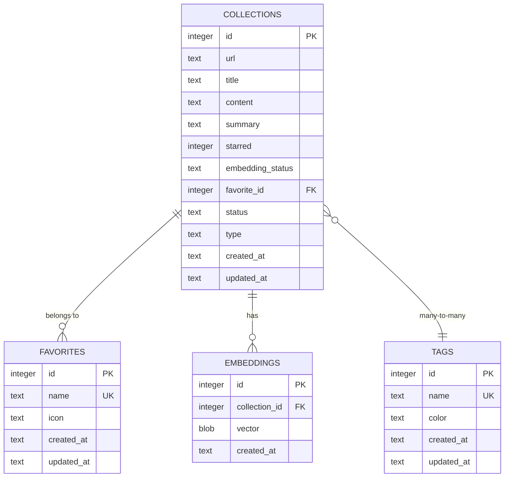

# 数据模型

<cite>
**本文档引用的文件**  
- [collections.rs](file://apps/desktop/src-tauri/src/db/collections.rs)
- [favorites.rs](file://apps/desktop/src-tauri/src/db/favorites.rs)
- [tags.rs](file://apps/desktop/src-tauri/src/db/tags.rs)
- [embeddings.rs](file://apps/desktop/src-tauri/src/db/embeddings.rs)
- [collection_tags.rs](file://apps/desktop/src-tauri/src/db/collection_tags.rs)
- [connection.rs](file://apps/desktop/src-tauri/src/db/connection.rs)
- [architecture.md](file://docs/architecture.md)
- [collection.ts](file://packages/shared/src/types/collection.ts)
</cite>

## 目录
1. [引言](#引言)
2. [核心数据实体](#核心数据实体)
3. [实体关系图（ERD）](#实体关系图（erd）)
4. [数据库Schema设计决策](#数据库schema设计决策)
5. [数据访问模式与性能优化](#数据访问模式与性能优化)
6. [结论](#结论)

## 引言
本项目是一个记忆增强工具，旨在帮助用户收集、组织和检索网络内容。其核心数据模型围绕四个主要实体构建：Collection（收藏）、Tag（标签）、Favorite（收藏夹）和Embedding（嵌入）。这些实体共同构成了一个强大的知识管理系统，支持语义搜索和知识图谱功能。数据存储在本地SQLite数据库中，利用`sqlite-vec`扩展来实现高效的向量嵌入存储和相似性搜索。

## 核心数据实体

### Collection（收藏）
`Collection`实体代表用户收集的任何内容，无论是从网页抓取的文章还是用户创建的笔记。它是系统中最核心的实体。

**字段定义：**
- `id` (INTEGER): 主键，自增。
- `url` (TEXT, 可为空): 内容来源的URL。对于用户创建的笔记，此字段为NULL。
- `title` (TEXT, 非空): 内容标题。
- `content` (TEXT, 非空): 内容正文，以Markdown格式存储。
- `summary` (TEXT, 可为空): AI生成的内容摘要。
- `starred` (INTEGER, 非空): 布尔值，表示是否被标记为星标（1为是，0为否）。
- `embedding_status` (TEXT, 非空): 嵌入向量的处理状态，包括`pending`（待处理）、`processing`（处理中）、`done`（已完成）和`failed`（失败）。
- `favorite_id` (INTEGER, 可为空): 外键，指向`favorites`表，表示所属的收藏夹。NULL表示“未分类”。
- `status` (TEXT, 非空): 内容状态，包括`active`（活跃）、`archived`（归档）和`deleted`（已删除）。
- `type` (TEXT, 非空): 内容类型，如“网页”、“笔记”、“代码”等，默认值为“网页”。
- `created_at` (TEXT, 非空): 创建时间，ISO 8601格式。
- `updated_at` (TEXT, 非空): 更新时间，ISO 8601格式。

**业务含义：** `Collection`是所有数据的中心。`url`字段的可空性允许系统同时管理网络收藏和本地笔记。`status`字段实现了软删除和归档功能，而`embedding_status`则跟踪了AI处理流程的进度。

**Section sources**
- [collections.rs](file://apps/desktop/src-tauri/src/db/collections.rs#L76-L90)
- [collection.ts](file://packages/shared/src/types/collection.ts#L34-L47)

### Favorite（收藏夹）
`Favorite`实体充当文件夹，用于对`Collection`进行分组和组织。

**字段定义：**
- `id` (INTEGER): 主键，自增。
- `name` (TEXT, 非空): 收藏夹名称。
- `icon` (TEXT, 可为空): 图标标识符。
- `created_at` (TEXT, 非空): 创建时间，ISO 8601格式。
- `updated_at` (TEXT, 非空): 更新时间，ISO 8601格式。

**业务含义：** `Favorite`提供了一种层次化的组织方式。系统会自动创建一个名为“未分类”的默认收藏夹，用于存放未被分配的收藏。当删除一个收藏夹时，其下的所有收藏会自动移动到“未分类”收藏夹中，确保数据不会丢失。

**Section sources**
- [favorites.rs](file://apps/desktop/src-tauri/src/db/favorites.rs#L13-L19)
- [collection.ts](file://packages/shared/src/types/collection.ts#L110-L116)

### Tag（标签）
`Tag`实体用于对`Collection`进行非层次化的分类和标记。

**字段定义：**
- `id` (INTEGER): 主键，自增。
- `name` (TEXT, 非空, 唯一): 标签名称。
- `color` (TEXT, 可为空): 标签显示颜色。
- `created_at` (TEXT, 非空): 创建时间，ISO 8601格式。
- `updated_at` (TEXT, 非空): 更新时间，ISO 8601格式。

**业务含义：** `Tag`支持多对多关系，一个收藏可以有多个标签，一个标签也可以应用于多个收藏。这为内容的组织提供了极大的灵活性。`name`字段的唯一性约束确保了标签的唯一性。

**Section sources**
- [tags.rs](file://apps/desktop/src-tauri/src/db/tags.rs#L13-L19)
- [collection.ts](file://packages/shared/src/types/collection.ts#L121-L127)

### Embedding（嵌入）
`Embedding`实体存储`Collection`内容的向量表示，用于实现语义搜索。

**字段定义：**
- `id` (INTEGER): 主键，自增。
- `collection_id` (INTEGER, 非空, 唯一): 外键，指向`collections`表，表示该嵌入向量所属的收藏。
- `vector` (BLOB, 非空): 384维的浮点数向量，以二进制大对象（BLOB）形式存储。
- `created_at` (TEXT, 非空): 创建时间，ISO 8601格式。

**业务含义：** `Embedding`是实现高级搜索功能的关键。通过将文本内容转换为向量，系统可以计算不同收藏之间的语义相似度，从而返回与查询在意义上相关的结果，而不仅仅是关键词匹配。`collection_id`的唯一性约束确保了一个收藏只能有一个嵌入向量。

**Section sources**
- [embeddings.rs](file://apps/desktop/src-tauri/src/db/embeddings.rs#L12-L17)
- [architecture.md](file://docs/architecture.md#L271-L277)

## 实体关系图（ERD）

**Diagram sources**
- [collections.rs](file://apps/desktop/src-tauri/src/db/collections.rs#L76-L90)
- [favorites.rs](file://apps/desktop/src-tauri/src/db/favorites.rs#L13-L19)
- [tags.rs](file://apps/desktop/src-tauri/src/db/tags.rs#L13-L19)
- [embeddings.rs](file://apps/desktop/src-tauri/src/db/embeddings.rs#L12-L17)

## 数据库Schema设计决策

### 选择SQLite的原因
本项目选择SQLite作为数据库引擎，主要基于以下几点：
1.  **轻量级与嵌入式**: SQLite是一个无服务器的、零配置的数据库，非常适合桌面应用程序。它将整个数据库存储在一个单一的磁盘文件中，简化了部署和备份。
2.  **本地优先**: 该应用的数据主要在本地处理和存储，SQLite的性能和可靠性在本地场景下表现优异。
3.  **ACID合规**: SQLite提供完整的ACID（原子性、一致性、隔离性、持久性）保证，确保了数据的完整性和可靠性。
4.  **低维护**: 无需独立的数据库服务器进程，减少了系统复杂性和资源消耗。

### 利用sqlite-vec扩展实现向量存储
为了支持语义搜索，系统需要存储和查询高维向量。为此，项目采用了`sqlite-vec`扩展，这是一个为SQLite设计的向量相似性搜索扩展。

**实现方式：**
- **向量维度**: 使用`all-MiniLM-L6-v2`模型生成384维的嵌入向量。
- **存储格式**: 向量以二进制大对象（BLOB）的形式存储在`embeddings`表的`vector`列中。每个384维的f32向量占用1536字节（384 * 4 bytes）。
- **相似性搜索**: `sqlite-vec`扩展提供了高效的向量操作函数，如余弦相似度计算。这使得系统能够快速执行`SELECT ... WHERE vec_cosine_similarity(embedding, ?) > 0.8`之类的查询，从而找到语义上相似的收藏。

**优势：**
- **一体化**: 将向量数据与结构化数据存储在同一个数据库中，避免了维护多个数据存储的复杂性。
- **性能**: `sqlite-vec`针对向量操作进行了优化，提供了比在应用层进行全表扫描和计算相似度快得多的性能。

**Section sources**
- [embeddings.rs](file://apps/desktop/src-tauri/src/db/embeddings.rs#L6-L7)
- [architecture.md](file://docs/architecture.md#L271-L277)
- [architecture.md](file://docs/architecture.md#L300-L302)

## 数据访问模式和性能优化策略

### 数据访问模式
系统遵循典型的CRUD（创建、读取、更新、删除）模式，并针对特定场景进行了优化：
- **收藏创建**: 当用户收藏一个网页时，系统会先检查`collections`表中是否已存在相同`url`的记录。如果存在，则删除旧记录（连同其嵌入向量），然后插入新记录。这确保了内容的更新。
- **列表查询**: `CollectionRepository::list`方法支持多种过滤条件（如按收藏夹、标签、状态过滤），并使用分页（limit/offset）来处理大量数据。
- **语义搜索**: 通过`EmbeddingsRepository::search`方法，系统可以计算查询向量与所有存储向量的余弦相似度，并返回最相似的Top-K结果。

### 索引的使用
索引是提升查询性能的关键。数据库Schema中定义了多个索引：
- `idx_collections_favorite_id`: 加速按`favorite_id`过滤收藏的查询。
- `idx_collections_status`: 加速按`status`（如`active`, `archived`）过滤的查询。
- `idx_collections_created_at`: 加速按创建时间排序的查询（如“最近收藏”）。
- `idx_collection_tags_collection_id` 和 `idx_collection_tags_tag_id`: 加速`collections`和`tags`之间的多对多关联查询。
- `idx_embeddings_collection_id`: 加速通过`collection_id`查找嵌入向量的查询。

这些索引确保了在用户界面中进行过滤、排序和搜索操作时，响应速度保持在可接受的范围内。

**Section sources**
- [architecture.md](file://docs/architecture.md#L280-L284)
- [collections.rs](file://apps/desktop/src-tauri/src/db/collections.rs#L302-L313)
- [embeddings.rs](file://apps/desktop/src-tauri/src/db/embeddings.rs#L138-L158)

## 结论
本项目的数据模型设计精巧，通过`Collection`、`Tag`、`Favorite`和`Embedding`四个核心实体，构建了一个功能强大且灵活的知识管理系统。采用SQLite作为基础数据库，结合`sqlite-vec`扩展，成功地将结构化数据管理与先进的向量搜索能力融为一体。这种设计不仅满足了基本的收藏和组织需求，还为未来的AI驱动功能（如知识图谱、智能推荐）奠定了坚实的基础。通过合理的索引策略，系统在保证数据完整性的同时，也确保了良好的查询性能。