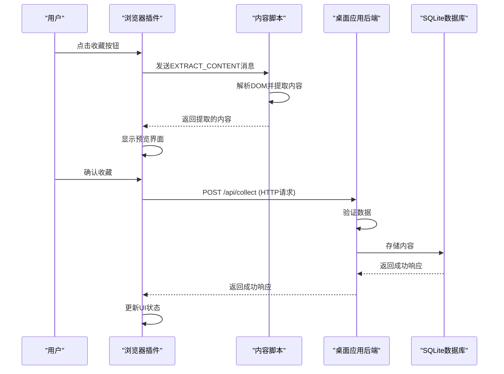
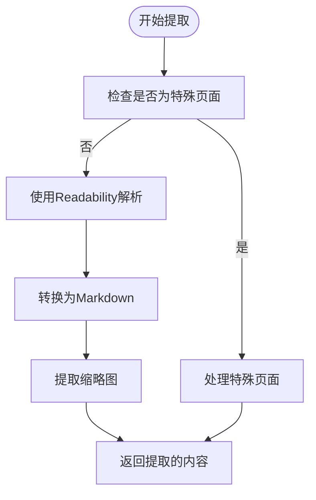
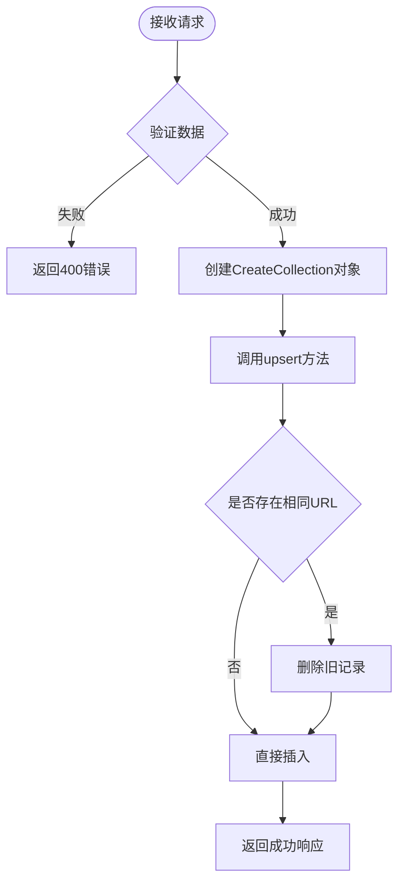

# 内容收集

<cite>
**本文档引用的文件**   
- [content-extractor.ts](file://apps/browser-extension/src/utils/content-extractor.ts)
- [use-collect.ts](file://apps/browser-extension/src/hooks/use-collect.ts)
- [handlers.rs](file://apps/desktop/src-tauri/src/server/handlers.rs)
- [collections.ts](file://packages/shared/src/apis/collections.ts)
- [api.ts](file://packages/shared/src/types/api.ts)
- [content.ts](file://apps/browser-extension/src/entrypoints/content.ts)
- [collections.rs](file://apps/desktop/src-tauri/src/db/collections.rs)
- [processor.ts](file://packages/ai/src/processor.ts)
</cite>

## 目录
1. [简介](#简介)
2. [数据流概述](#数据流概述)
3. [浏览器插件组件](#浏览器插件组件)
4. [桌面应用后端](#桌面应用后端)
5. [数据处理与存储](#数据处理与存储)
6. [端到端示例](#端到端示例)
7. [性能优化与错误处理](#性能优化与错误处理)
8. [API契约一致性](#api契约一致性)
9. [结论](#结论)

## 简介
内容收集功能是本系统的核心特性，它允许用户通过浏览器插件将网页内容保存到本地桌面应用中。该功能实现了从浏览器到桌面应用的完整数据流，包括DOM解析、内容提取、HTTP传输、后端处理和数据库存储。系统设计注重用户体验，提供了内容预览功能，并通过异步处理和错误重试机制确保数据收集的可靠性。

**Section sources**
- [content-extractor.ts](file://apps/browser-extension/src/utils/content-extractor.ts#L1-L751)
- [use-collect.ts](file://apps/browser-extension/src/hooks/use-collect.ts#L1-L194)

## 数据流概述
内容收集的数据流始于用户在浏览器中点击插件按钮，随后触发一系列协调操作。首先，插件使用`content-extractor.ts`解析当前页面的DOM，提取关键信息并转换为Markdown格式。接着，`use-collect.ts`处理用户交互，发起HTTP请求将数据发送到桌面应用。桌面应用的`handlers.rs`文件中的收集端点接收、验证并处理这些数据，最终将结构化的内容存储到SQLite数据库中。整个流程通过`shared`包确保前后端API契约的一致性。

**Diagram sources **
- [content-extractor.ts](file://apps/browser-extension/src/utils/content-extractor.ts#L1-L751)
- [use-collect.ts](file://apps/browser-extension/src/hooks/use-collect.ts#L1-L194)
- [handlers.rs](file://apps/desktop/src-tauri/src/server/handlers.rs#L1-L1371)

## 浏览器插件组件

### 内容提取机制
`content-extractor.ts`文件负责解析网页DOM并提取关键信息。它使用`@mozilla/readability`库来识别页面的主要内容区域，然后通过`turndown`库将HTML转换为Markdown格式。该文件定义了`PageContent`类型，包含URL、标题、内容和缩略图URL等字段。提取过程包括多个步骤：首先检查页面是否为特殊页面（如Bilibili或YouTube），然后使用Readability解析内容，最后通过自定义规则处理链接、图片、表格和代码块等元素。

**Diagram sources **
- [content-extractor.ts](file://apps/browser-extension/src/utils/content-extractor.ts#L1-L751)

**Section sources**
- [content-extractor.ts](file://apps/browser-extension/src/utils/content-extractor.ts#L1-L751)

### 用户交互处理
`use-collect.ts`文件中的`useCollect`钩子负责处理用户交互和发起HTTP请求。它定义了`CollectStatus`类型，表示收集过程的不同状态（空闲、提取中、预览中、收集中、成功、错误）。该钩子使用`useMutation`来管理异步操作，并在组件挂载时自动提取内容以供预览。当用户确认收藏时，它会调用`collectMutation.mutate`方法向后端发送数据。该文件还处理了内容脚本未加载的情况，通过`browser.scripting.executeScript`动态注入脚本。

**Section sources**
- [use-collect.ts](file://apps/browser-extension/src/hooks/use-collect.ts#L1-L194)
- [content.ts](file://apps/browser-extension/src/entrypoints/content.ts#L1-L44)

## 桌面应用后端

### 收集端点实现
`handlers.rs`文件中的`collect`函数是处理内容收集的核心后端逻辑。它接收来自浏览器插件的POST请求，验证输入数据（URL和标题不能为空），然后将内容保存到数据库。该函数使用`CollectionRepository`进行数据库操作，并支持设置收藏夹和标签。如果请求成功，它会返回包含新创建记录ID的响应；如果失败，则返回适当的错误信息。该端点还负责触发后续的AI处理流程，但实际的嵌入生成在后台服务中异步进行。

**Section sources**
- [handlers.rs](file://apps/desktop/src-tauri/src/server/handlers.rs#L1-L1371)
- [collections.rs](file://apps/desktop/src-tauri/src/db/collections.rs#L1-L816)

### 数据验证与处理
后端在接收数据后会进行严格的验证。`CollectRequest`结构体定义了请求体的格式，包括URL、标题、内容、收藏夹ID和标签数组。`collect`函数首先检查URL和标题是否为空，如果验证失败，则返回400错误。验证通过后，数据被封装为`CreateCollection`对象并传递给`CollectionRepository`的`upsert`方法。该方法会先删除具有相同URL的旧记录（如果有），然后插入新记录。这种设计确保了同一URL的内容只会有一条最新记录。

**Diagram sources **
- [handlers.rs](file://apps/desktop/src-tauri/src/server/handlers.rs#L1-L1371)
- [collections.rs](file://apps/desktop/src-tauri/src/db/collections.rs#L1-L816)

## 数据处理与存储

### 内容清洗与元数据生成
在数据存储到SQLite数据库之前，会经过一系列处理流程。`content-extractor.ts`中的`cleanMarkdown`函数负责清洗Markdown内容，包括规范化换行符和去除首尾空白。缩略图URL的提取遵循特定优先级：首先尝试Open Graph图像，然后是Twitter Card图像，接着是内容中的第一张图片，最后是网站图标。这些处理确保了存储内容的整洁性和一致性。此外，系统还支持为不同类型的页面（如GitHub仓库主页）提供特殊处理逻辑。

**Section sources**
- [content-extractor.ts](file://apps/browser-extension/src/utils/content-extractor.ts#L1-L751)
- [collections.rs](file://apps/desktop/src-tauri/src/db/collections.rs#L1-L816)

### 数据库架构
系统使用SQLite作为持久化存储，`collections.rs`文件定义了数据库操作的仓库模式。`Collection`结构体包含了ID、URL、标题、内容、摘要、收藏夹ID、状态等字段。`CollectionRepository`提供了CRUD操作，包括`upsert`、`get_by_id`、`list`等方法。数据库设计支持软删除（通过status字段）和硬删除，并提供了`cleanup_deleted_older_than`方法来定期清理已删除的记录。这种设计既保证了数据的完整性，又提供了良好的性能。

**Section sources**
- [collections.rs](file://apps/desktop/src-tauri/src/db/collections.rs#L1-L816)

## 端到端示例
让我们通过一个具体的例子来展示整个内容收集流程。假设用户正在浏览一篇复杂的新闻文章，点击插件按钮后，系统首先通过`content-extractor.ts`解析页面DOM，使用Readability识别主要内容区域，并将HTML转换为Markdown。特殊规则会处理文章中的图片、视频和表格，确保它们在Markdown中正确表示。提取完成后，`use-collect.ts`显示预览界面，用户确认后，数据通过HTTP POST请求发送到`/api/collect`端点。后端验证数据并调用`upsert`方法将记录插入数据库，同时设置相应的收藏夹和标签。最终，这条结构化的收藏记录可以在桌面应用中查看和管理。

**Section sources**
- [content-extractor.ts](file://apps/browser-extension/src/utils/content-extractor.ts#L1-L751)
- [use-collect.ts](file://apps/browser-extension/src/hooks/use-collect.ts#L1-L194)
- [handlers.rs](file://apps/desktop/src-tauri/src/server/handlers.rs#L1-L1371)

## 性能优化与错误处理

### 异步处理与错误重试
系统采用了多种性能优化策略。首先，内容提取和AI处理都是异步进行的，避免阻塞主线程。`processor.ts`文件中的`withRetry`函数实现了带指数退避的重试机制，最多重试3次，延迟时间逐次加倍。这种设计可以有效应对临时性网络故障。对于AI处理，系统还实现了请求限流器（`RateLimiter`），限制并发请求数量并设置请求间隔，避免超出API配额。结果缓存机制（基于内容哈希）进一步提高了性能，避免对相同内容重复处理。

**Section sources**
- [processor.ts](file://packages/ai/src/processor.ts#L58-L81)
- [processor.ts](file://packages/ai/src/processor.ts#L1219-L1260)

### 错误处理策略
系统具有完善的错误处理机制。前端在`use-collect.ts`中捕获并显示错误信息，如"无法获取当前标签页"或"内容脚本未加载"。后端在`handlers.rs`中使用Result类型处理各种可能的错误，包括数据库错误和模型不可用等。对于HTTP请求，系统设置了3秒的超时时间，并在连接失败时尝试重新注入内容脚本。这些多层次的错误处理确保了系统的健壮性，即使在部分组件失败的情况下也能提供有意义的反馈。

**Section sources**
- [use-collect.ts](file://apps/browser-extension/src/hooks/use-collect.ts#L1-L194)
- [handlers.rs](file://apps/desktop/src-tauri/src/server/handlers.rs#L1-L1371)

## API契约一致性
`shared`包在确保前后端API契约一致性方面发挥了关键作用。`collections.ts`文件定义了前端API接口，而`api.ts`文件则定义了共享的类型，如`CollectRequest`和`CollectSuccessResponse`。这种设计确保了前后端使用相同的类型定义，减少了因类型不匹配导致的错误。HTTP适配器（`createHttpAdapter`）封装了底层的网络请求细节，使前端代码更加简洁和可维护。通过这种方式，系统实现了前后端的松耦合，同时保证了数据交换的可靠性。

**Section sources**
- [collections.ts](file://packages/shared/src/apis/collections.ts#L1-L151)
- [api.ts](file://packages/shared/src/types/api.ts#L1-L142)

## 结论
内容收集功能通过精心设计的数据流和组件协作，实现了从浏览器到桌面应用的无缝内容保存。系统利用`content-extractor.ts`进行高效的DOM解析和内容提取，通过`use-collect.ts`处理用户交互，由`handlers.rs`在后端接收和处理数据，最终存储到SQLite数据库中。性能优化措施如异步处理、请求限流和结果缓存，以及完善的错误重试机制，确保了系统的可靠性和用户体验。`shared`包的使用保证了前后端API契约的一致性，为系统的可维护性和扩展性奠定了基础。