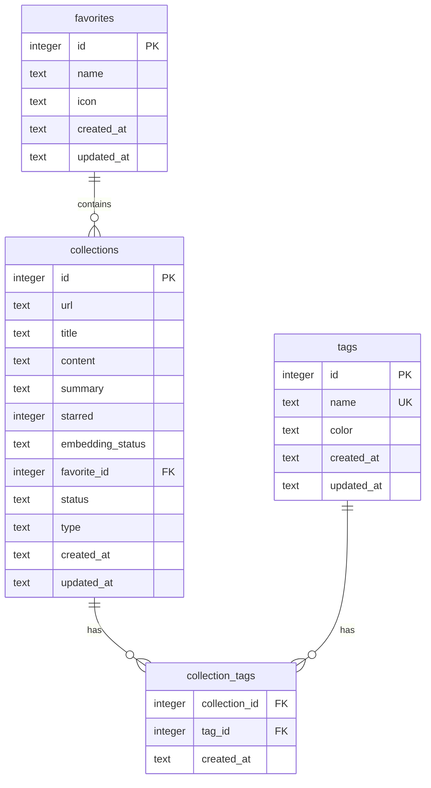

# 数据管理

<cite>
**本文档中引用的文件**  
- [connection.rs](file://apps/desktop/src-tauri/src/db/connection.rs)
- [collections.rs](file://apps/desktop/src-tauri/src/db/collections.rs)
- [tags.rs](file://apps/desktop/src-tauri/src/db/tags.rs)
- [favorites.rs](file://apps/desktop/src-tauri/src/db/favorites.rs)
- [collection_tags.rs](file://apps/desktop/src-tauri/src/db/collection_tags.rs)
- [mod.rs](file://apps/desktop/src-tauri/src/db/mod.rs)
</cite>

## 目录
1. [简介](#简介)
2. [数据库连接池管理](#数据库连接池管理)
3. [核心数据实体与CRUD操作](#核心数据实体与crud操作)
4. [数据库Schema设计](#数据库schema设计)
5. [数据访问层（DAL）模式](#数据访问层dal模式)
6. [数据一致性与事务处理](#数据一致性与事务处理)
7. [完整数据库交互示例](#完整数据库交互示例)
8. [结论](#结论)

## 简介

本项目采用SQLite作为本地数据持久化方案，通过Rusqlite库在Rust中实现类型安全的SQL操作。数据管理模块围绕“收藏”（collections）这一核心实体，支持用户对网页内容、笔记等信息的收集、分类和管理。系统通过“收藏夹”（favorites）和“标签”（tags）两个维度对收藏进行组织，并利用外键和索引确保数据的完整性和查询效率。整个数据访问层遵循仓库（Repository）模式，将数据库操作封装在独立的模块中，提高了代码的可维护性和可测试性。

**Section sources**
- [mod.rs](file://apps/desktop/src-tauri/src/db/mod.rs#L1-L62)

## 数据库连接池管理

数据库连接由`connection.rs`文件中的`Database`结构体管理。该结构体使用`Arc<Mutex<Connection>>`包装一个`rusqlite::Connection`，实现了线程安全的连接共享，充当了一个轻量级的连接池。当应用启动时，会调用`init_database`函数创建`Database`实例，该函数负责打开数据库文件、创建必要的目录，并进行初始化配置。

初始化过程中，系统会启用外键约束（`PRAGMA foreign_keys = ON`）以确保数据的参照完整性。同时，为了提高并发性能，系统会尝试启用WAL（Write-Ahead Logging）模式。如果WAL模式因文件系统限制（如网络文件系统）而失败，系统会自动回退到DELETE模式，并记录警告日志，保证了应用的健壮性。

`Database`结构体提供了`with_connection`和`with_connection_mut`两个方法，它们接受一个闭包作为参数。这些方法负责获取连接锁，将`Connection`对象传递给闭包执行，并在闭包执行完毕后自动释放锁。这种设计模式将资源管理的责任从调用者转移到了`Database`本身，有效避免了死锁和资源泄漏的风险。

**Section sources**
- [connection.rs](file://apps/desktop/src-tauri/src/db/connection.rs#L1-L800)

## 核心数据实体与CRUD操作

数据实体的CRUD（创建、读取、更新、删除）操作通过仓库模式（Repository Pattern）实现，每个核心实体都有对应的仓库结构体。

### 收藏（Collections）

`Collection`是核心数据实体，代表一个被用户收藏的网页或笔记。其仓库`CollectionRepository`提供了丰富的操作：
- `upsert`: 根据URL插入或更新收藏。如果URL已存在，则先删除旧记录再插入新记录，确保数据唯一性。
- `create_note`: 专门用于创建无URL的用户笔记，`url`字段为`NULL`。
- `get_by_id` / `get_by_url`: 根据ID或URL查询单个收藏。
- `list`: 列出收藏，支持分页、按收藏夹、按标签、按状态等条件过滤。
- `delete` / `archive` / `restore`: 实现软删除和归档功能，通过更新`status`字段实现，而非物理删除。
- `toggle_star` / `set_favorite`: 更新收藏的星标状态和所属收藏夹。

### 标签（Tags）

`Tag`实体用于对收藏进行分类。`TagRepository`提供了创建、更新、删除和查询标签的功能。标签的`name`字段具有唯一性约束，防止重复。`list`方法支持按名称、使用频率或创建时间排序。

### 收藏夹（Favorites）

`Favorite`实体（在代码中也称为“文件夹”）是另一种组织收藏的方式。`FavoriteRepository`的`list`方法会将名为“未分类”的收藏夹排在列表最前面。删除收藏夹时有特殊逻辑：如果要删除的是“未分类”收藏夹，系统会阻止删除；如果要删除的是其他收藏夹，系统会将其下的所有收藏移动到“未分类”收藏夹中，确保数据不丢失。

### 多对多关系管理

收藏与标签之间的多对多关系由`collection_tags`表和`CollectionTagRepository`管理。`CollectionTagRepository`提供了`add_tags`、`remove_tag`和`get_tags_by_collection`等方法，方便地管理收藏的标签集合。

**Section sources**
- [collections.rs](file://apps/desktop/src-tauri/src/db/collections.rs#L1-L816)
- [tags.rs](file://apps/desktop/src-tauri/src/db/tags.rs#L1-L322)
- [favorites.rs](file://apps/desktop/src-tauri/src/db/favorites.rs#L1-L317)
- [collection_tags.rs](file://apps/desktop/src-tauri/src/db/collection_tags.rs#L1-L204)

## 数据库Schema设计

数据库Schema设计精巧，通过合理的表结构、索引和外键约束支持高效查询。

### 核心表结构

- **collections**: 存储收藏的核心信息。`url`字段可为空（用于笔记），并有索引支持快速查找。`status`字段支持软删除和归档。`type`字段（如“网页”、“笔记”）用于内容类型区分。
- **tags**: 存储标签信息，`name`字段有唯一性约束。
- **favorites**: 存储收藏夹信息。
- **collection_tags**: 联结表，存储收藏与标签的多对多关系。其主键为`(collection_id, tag_id)`组合，确保一个收藏对一个标签的关联是唯一的。两个外键均设置`ON DELETE CASCADE`，当收藏或标签被删除时，其关联记录会自动被清除。

### 索引设计

索引设计针对主要查询场景：
- `idx_collections_url`: 加速基于URL的查找。
- `idx_collections_created_at`: 加速按创建时间排序的查询。
- `idx_collections_favorite_id`: 加速按收藏夹分组的查询。
- `idx_collection_tags_collection_id` 和 `idx_collection_tags_tag_id`: 加速通过收藏或标签查找关联对象的查询。

### 外键约束

所有外键均启用`ON DELETE CASCADE`，这保证了数据的一致性。例如，删除一个收藏时，其对应的嵌入向量（embeddings）、标签关联（collection_tags）等所有相关记录都会被自动删除，避免了孤儿记录的产生。

**Diagram sources**
- [connection.rs](file://apps/desktop/src-tauri/src/db/connection.rs#L171-L300)

## 数据访问层（DAL）模式

数据访问层采用了清晰的仓库模式，将数据库操作与业务逻辑分离。每个仓库（如`CollectionRepository`）都持有一个对`Database`的引用，并在其方法中通过`with_connection`执行SQL操作。

SQL查询使用`rusqlite`的`params!`宏进行参数化，有效防止了SQL注入攻击。查询结果通过`query_row`和`query_map`等方法映射到Rust的结构体上。例如，`CollectionRepository`中的`row_to_collection`函数负责将数据库行（Row）转换为`Collection`结构体实例。

Rust的类型系统在此处发挥了巨大作用。通过`serde`库的`Deserialize`和`Serialize`派生宏，数据库中的原始类型（如字符串）被自动转换为Rust的枚举类型（如`EmbeddingStatus`和`CollectionStatus`）。这不仅使代码更易读，而且在编译时就能捕获因数据库值不匹配而导致的错误，例如将数据库中的`"pending"`字符串安全地转换为`EmbeddingStatus::Pending`枚举值。

## 数据一致性与事务处理

数据一致性主要通过数据库层面的约束和应用逻辑来保证。

### 数据库约束

- **外键约束**：如前所述，`ON DELETE CASCADE`确保了关联数据的一致性。
- **唯一性约束**：`tags.name`的唯一性约束防止了重复标签。
- **非空约束**：关键字段如`collections.title`被定义为`NOT NULL`，保证了数据的完整性。

### 应用逻辑

应用层通过事务和特定逻辑来维护一致性。例如，在`migrate()`函数中，对`collections`表的结构迁移（如修改`url`字段为可空）是一个复杂的操作，涉及创建新表、复制数据、删除旧表和重命名。这个过程虽然没有显式使用事务，但通过创建备份和分步执行来降低风险。

在删除“未分类”收藏夹时，应用逻辑会阻止删除唯一的“未分类”收藏夹，或者在删除重复的“未分类”收藏夹时，将其下的收藏合并到保留的“未分类”收藏夹中，这保证了用户数据的逻辑一致性。

## 完整数据库交互示例

以下是一个创建新收藏并为其添加标签和收藏夹的完整流程：

1.  **创建收藏**：调用`CollectionRepository::create_note`方法，传入标题和内容。该方法在一个数据库连接中执行，插入一条`url`为`NULL`的新记录，并返回其`id`。
2.  **创建/获取标签**：首先调用`TagRepository::get_by_name`检查所需标签是否已存在。如果不存在，则调用`TagRepository::create`创建新标签，并获取其`id`。
3.  **设置收藏夹**：调用`FavoriteRepository::get_by_id`获取目标收藏夹的`id`。
4.  **更新收藏**：调用`CollectionRepository::set_favorite`，将上一步获得的收藏夹`id`与收藏`id`关联。
5.  **添加标签**：调用`CollectionTagRepository::add_tags`，将收藏`id`和一个或多个标签`id`数组传递给该方法，建立多对多关联。

整个过程由多个独立的数据库操作组成，每个操作都通过`Database`的连接管理方法安全地执行。Rust的类型系统确保了传递给这些方法的参数类型正确，而数据库的外键约束则保证了最终数据的参照完整性。

## 结论

该项目的本地数据管理策略设计周密，充分利用了SQLite的特性。通过仓库模式和Rusqlite库，实现了类型安全、易于维护的数据访问层。精心设计的Schema和索引支持了高效的CRUD操作和复杂查询。结合数据库约束和应用层逻辑，系统在数据一致性和用户体验之间取得了良好的平衡。Rust强大的类型系统是防止数据操作错误的关键，使得许多潜在的运行时错误在编译阶段就被发现，极大地提升了应用的可靠性和开发效率。