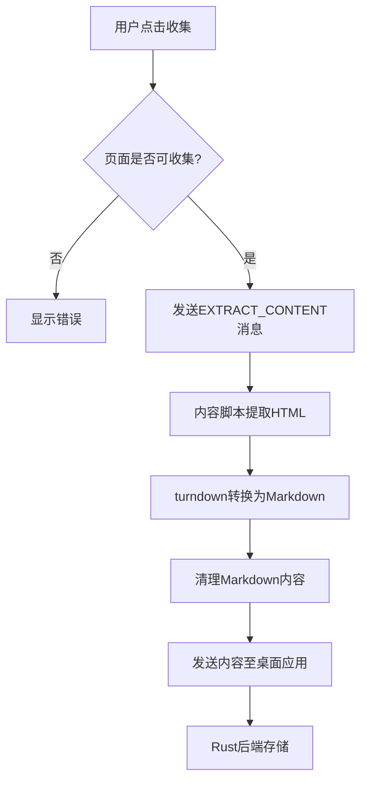
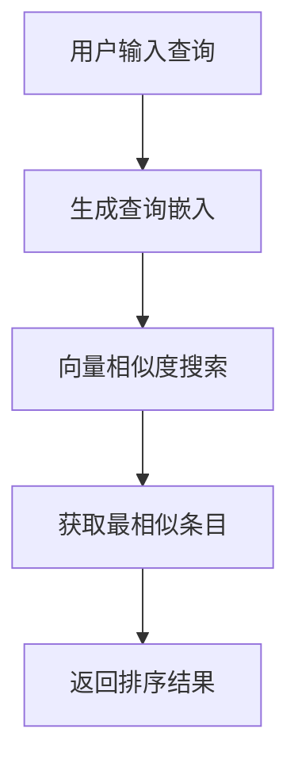
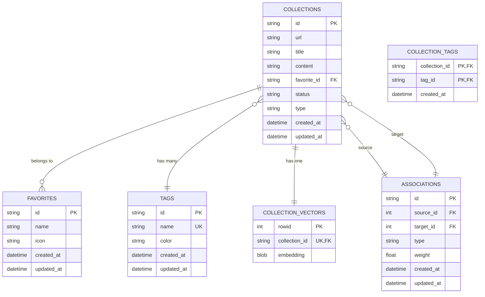
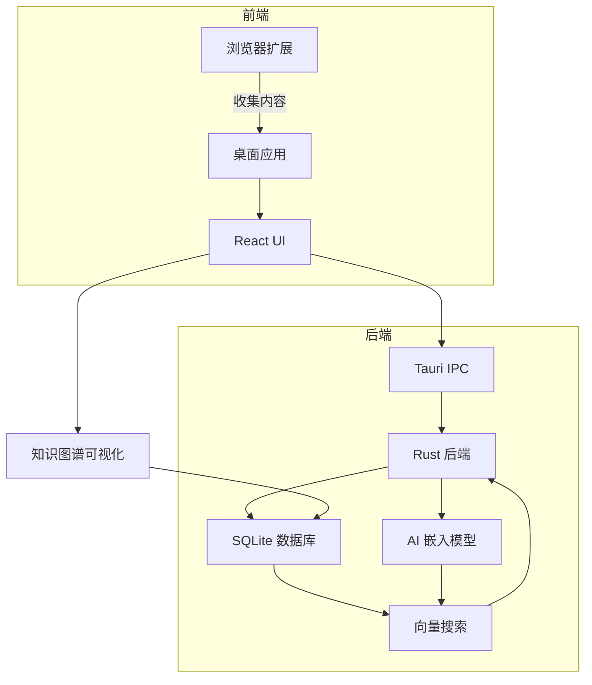
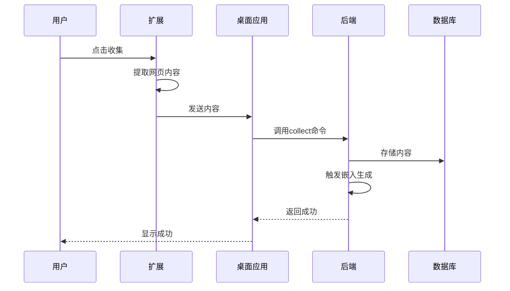

# 核心功能

<cite>
**本文档引用的文件**  
- [README.md](file://README.md)
- [architecture.md](file://docs/architecture.md)
- [use-collect.ts](file://apps/browser-extension/src/hooks/use-collect.ts)
- [content-extractor.ts](file://apps/browser-extension/src/utils/content-extractor.ts)
- [lib.rs](file://apps/desktop/src-tauri/src/lib.rs)
- [collections.rs](file://apps/desktop/src-tauri/src/db/collections.rs)
- [handlers.rs](file://apps/desktop/src-tauri/src/server/handlers.rs)
- [model.rs](file://apps/desktop/src-tauri/src/embedding/model.rs)
- [processor.ts](file://packages/ai/src/processor.ts)
- [graph.ts](file://packages/shared/src/types/graph.ts)
</cite>

## 目录
1. [简介](#简介)
2. [内容收集](#内容收集)
3. [语义搜索](#语义搜索)
4. [数据管理](#数据管理)
5. [功能协同与闭环](#功能协同与闭环)
6. [设计理念](#设计理念)
7. [架构与流程图](#架构与流程图)

## 简介

记忆外挂（Memory Prosthetic）是一款本地优先的知识管理工具，旨在帮助用户收集、组织和搜索个人知识内容。其核心功能围绕三大支柱构建：内容收集、语义搜索和数据管理。这些功能协同工作，形成一个完整的知识管理闭环，让用户能够“想到即找到，看到即记住”。

该系统采用本地优先和隐私保护的设计理念，所有数据均存储在用户本地设备上。前端使用React 19和TypeScript构建，桌面应用基于Tauri框架，后端使用Rust处理本地操作，数据库采用SQLite并结合sqlite-vec实现向量搜索，AI模型使用本地的all-MiniLM-L6-v2进行嵌入生成。

**本节来源**
- [README.md](file://README.md#L1-L256)

## 内容收集

内容收集功能允许用户通过浏览器扩展一键保存网页内容。系统会自动提取网页的主要内容，并将其转换为简洁的Markdown格式摘要，从而将复杂的网页转化为结构化的知识条目。

### 收集流程

1. **触发收集**：用户在浏览器中点击扩展图标，触发收集操作。
2. **内容提取**：扩展通过消息传递与内容脚本通信，使用`@mozilla/readability`库提取网页主体内容。
3. **格式转换**：提取的HTML内容通过`turndown`库转换为Markdown格式。
4. **数据清理**：对Markdown内容进行清理，移除多余换行和空白字符。
5. **发送至桌面应用**：处理后的内容通过API发送到桌面应用的Rust后端进行存储。

**图表来源**
- [use-collect.ts](file://apps/browser-extension/src/hooks/use-collect.ts#L1-L143)
- [content-extractor.ts](file://apps/browser-extension/src/utils/content-extractor.ts#L1-L736)
- [lib.rs](file://apps/desktop/src-tauri/src/lib.rs#L758-L800)

### 技术实现

- **前端**：浏览器扩展使用WXT框架，通过`useCollect` Hook管理收集状态和流程。
- **内容提取**：使用`@mozilla/readability`确保提取网页主要内容，避免广告和导航栏等干扰。
- **后端**：Rust后端通过`collect`命令接收内容并存入数据库，同时触发嵌入生成服务。

**本节来源**
- [use-collect.ts](file://apps/browser-extension/src/hooks/use-collect.ts#L1-L143)
- [content-extractor.ts](file://apps/browser-extension/src/utils/content-extractor.ts#L1-L736)
- [lib.rs](file://apps/desktop/src-tauri/src/lib.rs#L758-L800)

## 语义搜索

语义搜索功能允许用户根据内容的含义而非关键词进行搜索。系统使用本地AI模型生成内容的向量嵌入，并通过向量相似度进行搜索，从而实现更智能和精准的检索。

### 搜索流程

1. **生成查询嵌入**：用户输入查询后，系统使用本地AI模型（all-MiniLM-L6-v2）生成查询文本的向量嵌入。
2. **向量相似度搜索**：在SQLite数据库中使用`sqlite-vec`扩展进行向量相似度搜索，找到与查询嵌入最相似的内容嵌入。
3. **返回结果**：根据相似度排序，返回最相关的内容条目。

**图表来源**
- [handlers.rs](file://apps/desktop/src-tauri/src/server/handlers.rs#L205-L285)
- [model.rs](file://apps/desktop/src-tauri/src/embedding/model.rs#L186-L230)

### 技术实现

- **嵌入模型**：使用all-MiniLM-L6-v2模型，生成384维的向量嵌入。
- **推理框架**：使用ONNX Runtime (ort) 进行模型推理。
- **数据库**：使用SQLite的`sqlite-vec`扩展存储和搜索向量。
- **API**：通过`/api/search`端点接收搜索请求并返回结果。

**本节来源**
- [handlers.rs](file://apps/desktop/src-tauri/src/server/handlers.rs#L205-L285)
- [model.rs](file://apps/desktop/src-tauri/src/embedding/model.rs#L186-L230)
- [architecture.md](file://docs/architecture.md#L228-L312)

## 数据管理

数据管理功能提供收藏夹、标签和知识图谱等工具，帮助用户组织和关联收集的内容，实现知识的结构化管理。

### 收藏夹与标签

- **收藏夹**：用户可以创建收藏夹（Favorites）对内容进行分类管理。每个内容条目可以关联一个收藏夹。
- **标签**：用户可以为内容添加多个标签（Tags），实现多维度分类和快速检索。

### 知识图谱

知识图谱可视化内容之间的关联关系，帮助用户发现知识间的隐性联系。

- **节点**：每个内容条目作为一个节点。
- **边**：节点之间的关联关系作为边，包括语义相似、标签相同、时间邻近等多种类型。
- **布局**：使用力导向布局算法，关联性越强的节点距离越近。

**图表来源**
- [collections.rs](file://apps/desktop/src-tauri/src/db/collections.rs#L1-L816)
- [graph.ts](file://packages/shared/src/types/graph.ts#L1-L66)
- [architecture.md](file://docs/architecture.md#L228-L312)

### 技术实现

- **数据库**：使用SQLite存储内容、收藏夹、标签和关联关系。
- **关联发现**：系统自动计算内容间的语义相似度、标签重叠度等，生成关联关系。
- **图谱构建**：前端使用AntV G6库可视化知识图谱。

**本节来源**
- [collections.rs](file://apps/desktop/src-tauri/src/db/collections.rs#L1-L816)
- [graph.ts](file://packages/shared/src/types/graph.ts#L1-L66)
- [GraphView.tsx](file://apps/desktop/src/components/features/GraphView.tsx#L701-L727)

## 功能协同与闭环

内容收集、语义搜索和数据管理三大功能协同工作，形成一个完整的知识管理闭环。

1. **收集**：用户通过浏览器扩展收集网页内容，系统自动提取和转换内容。
2. **处理**：后端系统为新内容生成向量嵌入，并计算与其他内容的关联关系。
3. **管理**：用户通过收藏夹、标签和知识图谱组织和关联内容。
4. **搜索**：用户通过语义搜索快速找到所需内容，无论是否记得确切关键词。
5. **反馈**：用户的搜索和管理行为为系统提供反馈，优化未来的关联计算和搜索结果。

这个闭环确保了知识从收集到检索的完整流程，提高了知识管理的效率和效果。

**本节来源**
- [README.md](file://README.md#L1-L256)
- [architecture.md](file://docs/architecture.md#L228-L312)

## 设计理念

### 本地优先

所有数据均存储在用户本地设备上，不上传至任何服务器。这确保了用户数据的隐私和安全，同时也提供了更快的访问速度和离线可用性。

### 隐私保护

系统不收集或传输用户内容到外部服务器。AI模型在本地运行，所有处理均在用户设备上完成。

### 用户体验

- **简洁**：一键收集，快速搜索。
- **直观**：知识图谱可视化，直观展示知识关联。
- **高效**：语义搜索，精准匹配用户意图。

**本节来源**
- [README.md](file://README.md#L1-L256)
- [architecture.md](file://docs/architecture.md#L228-L312)

## 架构与流程图

### 系统架构

**图表来源**
- [README.md](file://README.md#L39-L53)
- [lib.rs](file://apps/desktop/src-tauri/src/lib.rs#L1-L800)
- [architecture.md](file://docs/architecture.md#L228-L312)

### 用户操作流程

**图表来源**
- [use-collect.ts](file://apps/browser-extension/src/hooks/use-collect.ts#L1-L143)
- [lib.rs](file://apps/desktop/src-tauri/src/lib.rs#L758-L800)
- [collections.rs](file://apps/desktop/src-tauri/src/db/collections.rs#L1-L816)