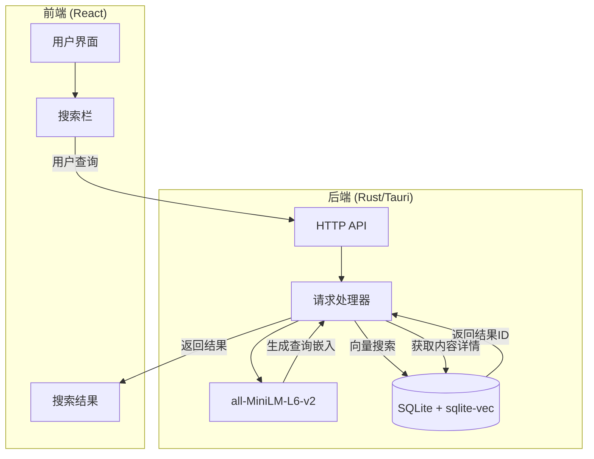
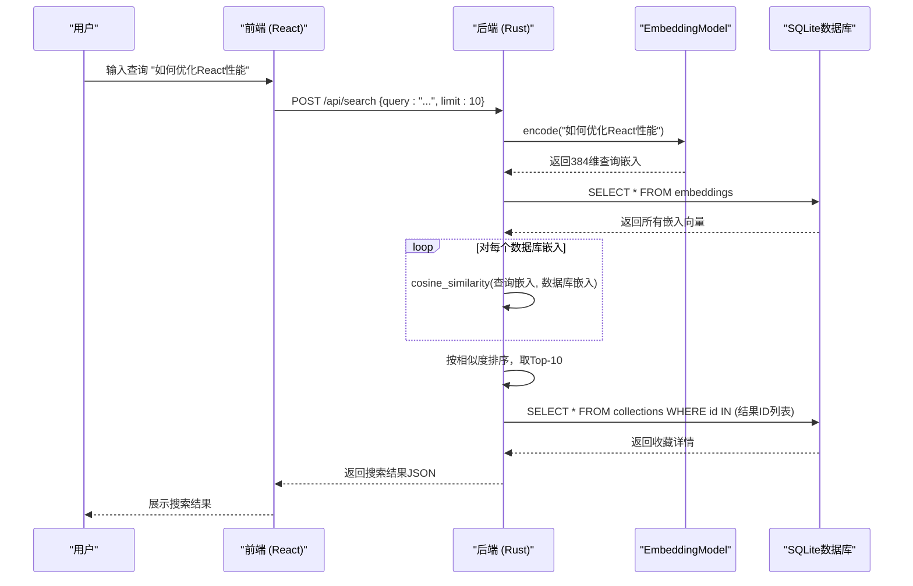

# 语义搜索

<cite>
**本文档引用的文件**
- [model.rs](file://apps/desktop/src-tauri/src/embedding/model.rs)
- [handlers.rs](file://apps/desktop/src-tauri/src/server/handlers.rs)
- [embeddings.rs](file://apps/desktop/src-tauri/src/db/embeddings.rs)
- [tech-spec-knowledge-graph-and-ai.md](file://docs/tech-spec-knowledge-graph-and-ai.md)
- [association.rs](file://apps/desktop/src-tauri/src/graph/association.rs)
- [discovery.rs](file://apps/desktop/src-tauri/src/graph/discovery.rs)
- [main.rs](file://apps/desktop/src-tauri/src/main.rs)
- [lib.rs](file://apps/desktop/src-tauri/src/lib.rs)
</cite>

## 目录
1. [简介](#简介)
2. [技术栈与架构](#技术栈与架构)
3. [核心组件分析](#核心组件分析)
4. [语义搜索工作流程](#语义搜索工作流程)
5. [数据流与生命周期](#数据流与生命周期)
6. [性能与准确性权衡](#性能与准确性权衡)
7. [本地嵌入模型的设计决策](#本地嵌入模型的设计决策)
8. [结论](#结论)

## 简介

语义搜索功能是本应用的核心特性之一，它允许用户通过自然语言查询来发现和检索与其收藏内容在意义上相关的信息。该功能不依赖于关键词匹配，而是利用AI模型将文本转换为高维向量（嵌入），并通过计算向量间的相似度来找到最相关的结果。本文档深入探讨了其背后的技术实现，特别是all-MiniLM-L6-v2模型和sqlite-vec扩展的集成，以及为何选择本地处理而非云端API。

## 技术栈与架构

语义搜索的实现依赖于一个精心设计的技术栈，该栈结合了本地机器学习推理、高效的向量数据库操作和清晰的前后端分离架构。

- **嵌入模型 (Embedding Model)**: 使用 `all-MiniLM-L6-v2` 模型，这是一个轻量级的Sentence-BERT变体，专门用于生成高质量的句子嵌入。该模型由ONNX Runtime在本地执行，输入为文本，输出为384维的浮点数向量。
- **向量数据库 (Vector Database)**: 利用 `sqlite-vec` 扩展，为SQLite数据库添加了原生的向量相似度搜索能力。这使得应用可以在不引入外部依赖的情况下，高效地执行近似最近邻（ANN）搜索。
- **后端框架**: 使用Rust语言和Tauri框架构建，确保了高性能和内存安全。后端通过Axum框架提供HTTP API。
- **前端框架**: 使用React构建用户界面，通过Tauri的IPC机制与Rust后端通信。

**系统架构图**

**图示来源**
- [handlers.rs](file://apps/desktop/src-tauri/src/server/handlers.rs#L205-L313)
- [model.rs](file://apps/desktop/src-tauri/src/embedding/model.rs#L48-L210)
- [embeddings.rs](file://apps/desktop/src-tauri/src/db/embeddings.rs#L139-L158)

## 核心组件分析

### 模型服务 (`model.rs`)

`model.rs` 文件定义了 `EmbeddingModel` 结构体，负责加载和管理 `all-MiniLM-L6-v2` 模型。

- **模型加载**: `EmbeddingModel::new()` 方法从指定目录加载 `model.onnx` 和 `tokenizer.json` 文件。它使用ONNX Runtime进行推理，并配置了优化级别和线程数以提升性能。
- **文本编码**: `encode()` 和 `encode_batch()` 方法将输入文本转换为嵌入向量。流程包括：
  1. **分词 (Tokenization)**: 使用 `tokenizers` 库将文本转换为模型可接受的token ID序列。
  2. **推理 (Inference)**: 将token ID、注意力掩码等输入到ONNX模型中，获取输出的隐藏状态。
  3. **池化 (Pooling)**: 对输出的token嵌入进行**均值池化 (Mean Pooling)**，得到一个代表整个句子的单一向量。
  4. **归一化 (Normalization)**: 对池化后的向量进行L2归一化，确保向量长度为1，便于后续的余弦相似度计算。
- **全局实例**: 通过 `once_cell::sync::OnceCell` 和 `Arc<Mutex<>>` 创建了一个全局的、线程安全的模型实例，避免了重复加载和内存浪费。

**Section sources**
- [model.rs](file://apps/desktop/src-tauri/src/embedding/model.rs#L1-L256)

### 搜索端点 (`handlers.rs`)

`handlers.rs` 文件中的 `search()` 函数是语义搜索的入口点，处理来自前端的POST请求。

- **请求处理**: 接收包含 `query` 字符串和可选 `limit` 参数的JSON请求体。
- **嵌入生成**: 调用全局的 `get_embedding_model()` 获取模型实例，并使用 `encode()` 方法为查询文本生成一个384维的嵌入向量。
- **向量搜索**: 将生成的查询嵌入传递给 `EmbeddingsRepository` 的 `search()` 方法，执行向量相似度搜索。
- **结果组装**: 根据搜索返回的ID列表，从数据库中获取对应收藏的详细信息（标题、URL等），并构建包含相似度分数的响应。

**Section sources**
- [handlers.rs](file://apps/desktop/src-tauri/src/server/handlers.rs#L205-L313)

### 数据访问层 (`embeddings.rs`)

`embeddings.rs` 文件中的 `EmbeddingsRepository` 负责嵌入向量的存储和检索。

- **向量存储**: `upsert()` 方法将嵌入向量（`Vec<f32>`）序列化为字节数组（使用小端字节序），并存入SQLite的 `embeddings` 表中。使用 `ON CONFLICT` 语句确保每个收藏ID只有一个嵌入。
- **向量检索**: `get_by_collection_id()` 方法从数据库读取字节数组，并反序列化回 `Vec<f32>`。
- **相似度搜索**: `search()` 方法实现了基于余弦相似度的搜索。它首先通过 `get_all()` 获取所有嵌入，然后计算查询向量与每个数据库向量的余弦相似度，最后按相似度排序并返回前K个结果。
- **余弦相似度**: `cosine_similarity()` 函数计算两个向量的点积除以它们的L2范数的乘积，结果范围在-1到1之间，值越接近1表示越相似。

**Section sources**
- [embeddings.rs](file://apps/desktop/src-tauri/src/db/embeddings.rs#L1-L233)

## 语义搜索工作流程

一次完整的搜索请求从用户输入到返回结果的生命周期如下：

1.  **用户输入**: 用户在前端搜索栏中输入查询，例如 "如何优化React性能"。
2.  **API调用**: 前端通过HTTP POST请求将查询发送到后端的 `/api/search` 端点。
3.  **模型初始化检查**: `search()` 处理器首先检查全局的 `EmbeddingModel` 是否已加载。如果未加载（例如模型文件缺失），则返回服务不可用错误。
4.  **查询嵌入生成**: 处理器获取模型实例的锁，调用 `encode()` 方法。模型对查询文本进行分词、推理、均值池化和L2归一化，生成一个384维的查询嵌入向量。
5.  **向量相似度搜索**: 处理器调用 `EmbeddingsRepository.search()` 方法，传入查询嵌入和限制数量（如10）。
6.  **数据库遍历与计算**: `search()` 方法从 `embeddings` 表中加载所有嵌入向量。对于每一个数据库中的嵌入向量，它都调用 `cosine_similarity()` 函数计算其与查询向量的相似度。
7.  **结果排序与截取**: 所有计算出的相似度分数与对应的收藏ID一起被收集到一个列表中，该列表按相似度从高到低排序，然后截取前N个结果。
8.  **内容详情获取**: 处理器使用返回的收藏ID列表，查询 `collections` 表以获取每个结果的标题、URL、创建时间等元数据。
9.  **响应构建与返回**: 处理器将结果列表和原始查询构建成一个JSON响应，并通过HTTP返回给前端。
10. **前端展示**: 前端接收到响应后，将搜索结果以列表或卡片的形式展示给用户。

**图示来源**
- [handlers.rs](file://apps/desktop/src-tauri/src/server/handlers.rs#L205-L313)
- [model.rs](file://apps/desktop/src-tauri/src/embedding/model.rs#L90-L210)
- [embeddings.rs](file://apps/desktop/src-tauri/src/db/embeddings.rs#L139-L158)

## 数据流与生命周期

语义搜索的数据流清晰地展示了信息在系统各组件间的流动：

- **输入流**: 用户的自然语言查询。
- **处理流**: 查询文本 -> 分词 -> ONNX模型推理 -> 隐藏状态 -> 均值池化 -> L2归一化 -> 384维查询嵌入。
- **存储流**: 收藏内容 -> 嵌入服务 -> `EmbeddingModel.encode()` -> 384维内容嵌入 -> `vector_to_bytes()` -> 存入 `embeddings` 表。
- **搜索流**: 查询嵌入 -> 与所有数据库嵌入计算余弦相似度 -> 排序 -> 获取Top-K ID -> 查询 `collections` 表 -> 组装结果 -> 返回JSON。

**Section sources**
- [model.rs](file://apps/desktop/src-tauri/src/embedding/model.rs#L90-L210)
- [embeddings.rs](file://apps/desktop/src-tauri/src/db/embeddings.rs#L44-L70)
- [handlers.rs](file://apps/desktop/src-tauri/src/server/handlers.rs#L205-L313)

## 性能与准确性权衡

语义搜索的实现需要在性能和准确性之间做出权衡。

- **准确性**: `all-MiniLM-L6-v2` 模型在多个语义相似度任务上表现良好，能够捕捉到文本的深层含义。余弦相似度是衡量向量方向一致性的标准方法，非常适合比较文本嵌入。
- **性能**:
  - **优点**: 本地模型避免了网络延迟，响应速度快。ONNX Runtime经过高度优化，推理效率高。
  - **缺点**: 当前的 `search()` 实现是**暴力搜索 (Brute-force Search)**，即计算查询向量与数据库中每一个向量的相似度。随着收藏数量的增长（例如超过10,000条），搜索时间会线性增加，成为性能瓶颈。
- **优化建议**:
  - **索引**: `sqlite-vec` 支持创建向量索引（如HNSW），可以将搜索时间从O(N)降低到接近O(log N)，极大地提升大规模数据集下的搜索速度。
  - **嵌入维度**: 虽然384维是 `all-MiniLM-L6-v2` 的固定输出，但可以选择其他维度更低的模型（如256维）来减少计算和存储开销，但可能会牺牲一些准确性。
  - **搜索参数**: 可以调整 `top_k` 参数来平衡结果数量和响应时间。

**Section sources**
- [embeddings.rs](file://apps/desktop/src-tauri/src/db/embeddings.rs#L139-L158)
- [model.rs](file://apps/desktop/src-tauri/src/embedding/model.rs#L7)

## 本地嵌入模型的设计决策

根据 `tech-spec-knowledge-graph-and-ai.md` 文档中的设计决策，选择本地嵌入模型而非云端API是出于以下几个关键原因：

1.  **隐私与数据安全**: 用户的收藏内容可能包含敏感或私密信息。在本地处理数据意味着这些内容永远不会离开用户的设备，从根本上杜绝了数据泄露的风险。而云端API需要将文本发送到第三方服务器，存在隐私隐患。
2.  **离线可用性**: 本地模型使得语义搜索功能在没有网络连接时依然可用。用户可以在任何地方，无论是否有互联网，都能快速检索自己的知识库。
3.  **成本控制**: 云端AI API（如OpenAI）通常按调用次数或token数量收费。对于一个需要频繁生成嵌入的应用，长期使用成本会非常高。本地模型只需一次性下载，后续使用完全免费。
4.  **性能与延迟**: 本地推理避免了网络往返的延迟，提供了更快、更流畅的用户体验。搜索响应几乎是即时的。
5.  **架构一致性**: 该应用的整体架构倾向于将核心功能（如知识图谱构建、AI处理）放在本地，以实现一个自给自足、不依赖外部服务的“记忆假体”。本地嵌入是这一理念的自然延伸。

尽管本地模型在模型更新和维护上需要更多工作，但其在隐私、成本和可用性方面的优势，使其成为本应用的理想选择。

**Section sources**
- [tech-spec-knowledge-graph-and-ai.md](file://docs/tech-spec-knowledge-graph-and-ai.md#L62-L65)
- [tech-spec-knowledge-graph-and-ai.md](file://docs/tech-spec-knowledge-graph-and-ai.md#L137-L141)

## 结论

语义搜索功能通过集成 `all-MiniLM-L6-v2` 本地嵌入模型和 `sqlite-vec` 向量数据库扩展，为用户提供了一种强大且私密的信息检索方式。其架构清晰，组件职责分明：`model.rs` 负责高效的本地推理，`handlers.rs` 作为API网关协调流程，`embeddings.rs` 管理向量的持久化和搜索。虽然当前的暴力搜索算法在数据量大时可能存在性能瓶颈，但其设计决策——优先考虑用户隐私、离线可用性和成本效益——是合理且符合应用愿景的。未来通过引入向量索引等优化，可以进一步提升其在大规模数据集上的表现。