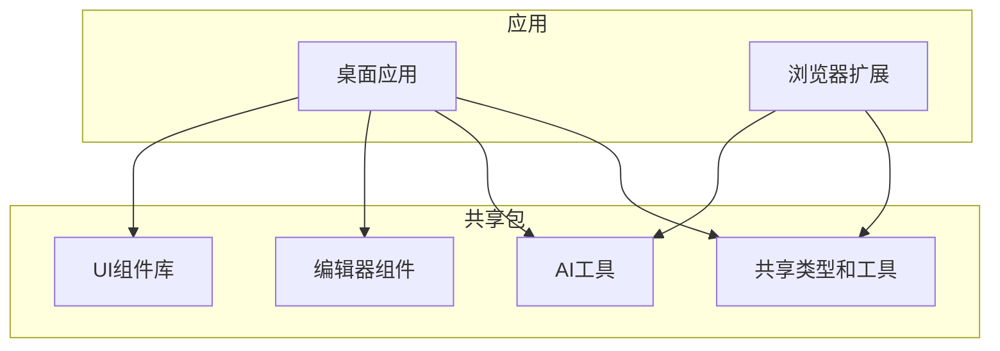
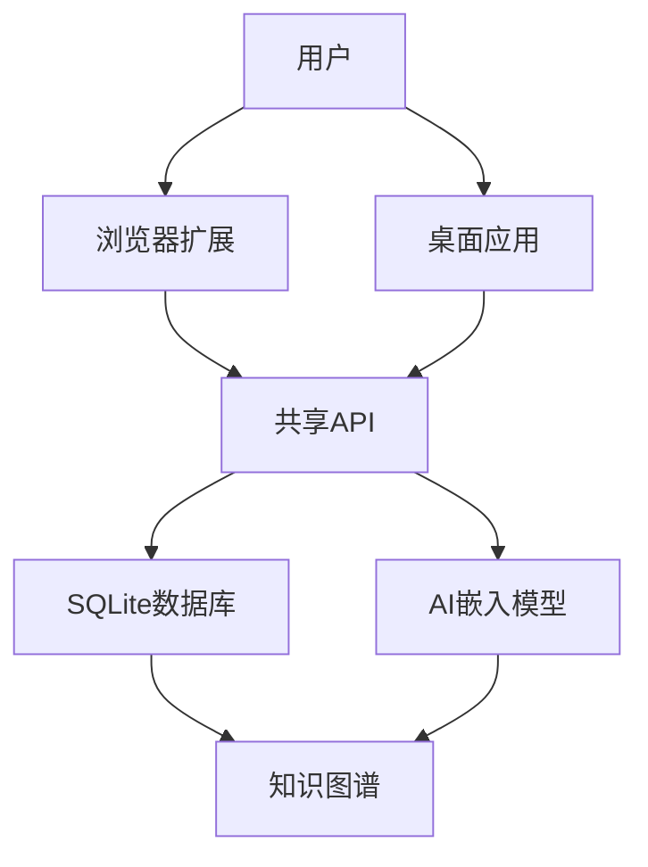
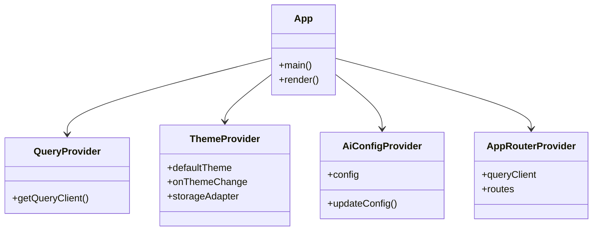
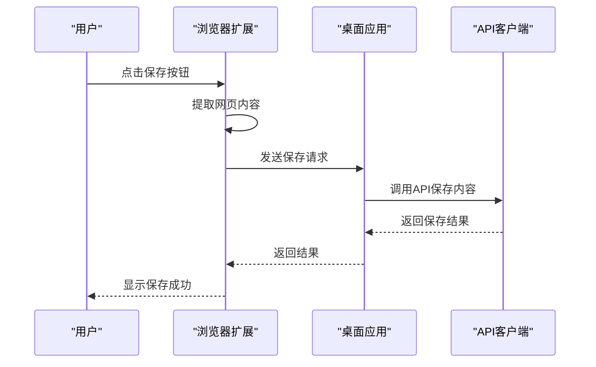
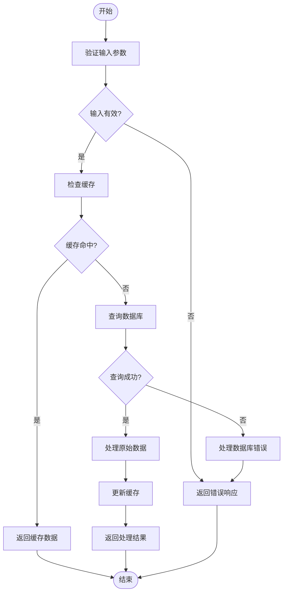
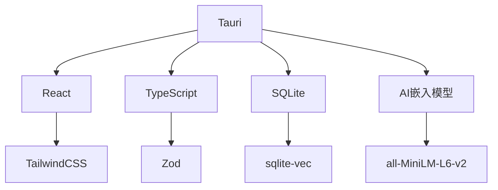

# 项目概述

<cite>
**本文档引用的文件**  
- [README.md](file://README.md)
- [package.json](file://package.json)
- [apps/desktop/src/main.tsx](file://apps/desktop/src/main.tsx)
- [apps/browser-extension/src/entrypoints/background.ts](file://apps/browser-extension/src/entrypoints/background.ts)
- [packages/shared/src/index.ts](file://packages/shared/src/index.ts)
- [apps/desktop/src/apis/index.ts](file://apps/desktop/src/apis/index.ts)
- [apps/browser-extension/src/apis/index.ts](file://apps/browser-extension/src/apis/index.ts)
- [packages/ai/src/index.ts](file://packages/ai/src/index.ts)
- [apps/desktop/src/types/api.ts](file://apps/desktop/src/types/api.ts)
- [apps/desktop/src/routes/search.tsx](file://apps/desktop/src/routes/search.tsx)
- [apps/desktop/src-tauri/src/db/mod.rs](file://apps/desktop/src-tauri/src/db/mod.rs)
- [apps/desktop/src-tauri/src/embedding/service.rs](file://apps/desktop/src-tauri/src/embedding/service.rs)
- [apps/desktop/src-tauri/src/graph/association.rs](file://apps/desktop/src-tauri/src/graph/association.rs)
</cite>

## 目录
1. [简介](#简介)
2. [项目结构](#项目结构)
3. [核心组件](#核心组件)
4. [架构概述](#架构概述)
5. [详细组件分析](#详细组件分析)
6. [依赖分析](#依赖分析)
7. [性能考虑](#性能考虑)
8. [故障排除指南](#故障排除指南)
9. [结论](#结论)

## 简介
**记忆外挂**（Memory Prosthetic）是一款本地优先的知识管理工具，旨在帮助用户解决“看过但找不到”的知识焦虑问题。该项目的核心使命是将模糊的记忆转化为精确的检索体验，通过浏览器插件一键收集网页内容、利用语义搜索快速找回信息，并通过知识图谱可视化组织个人知识库。项目采用Monorepo架构，包含桌面应用、浏览器扩展和共享包，致力于成为一个私密、高效、智能的个人记忆增强系统。

## 项目结构
该项目采用Monorepo架构，分为`apps`和`packages`两个主要目录。`apps`目录包含桌面应用和浏览器扩展，而`packages`目录则包含共享的AI工具、编辑器组件、类型定义和UI组件库。

**图示来源**
- [README.md](file://README.md)

**本节来源**
- [README.md](file://README.md)

## 核心组件
项目的核心组件包括桌面应用、浏览器扩展和共享包。桌面应用基于Tauri框架，提供语义搜索、知识图谱可视化和MCP协议集成等功能。浏览器扩展基于WXT构建，支持一键保存网页内容。共享包提供类型定义、工具函数和API客户端，确保代码的可重用性和一致性。

**本节来源**
- [README.md](file://README.md)
- [package.json](file://package.json)

## 架构概述
项目采用Monorepo架构，使用Bun作为包管理器，支持独立运行和构建各个包。桌面应用使用Tauri框架，结合React和TypeScript，提供本地优先的用户体验。浏览器扩展使用WXT工具，兼容Manifest V3，确保与现代浏览器的兼容性。共享包通过TypeScript和Rust实现高性能的本地AI嵌入和数据库操作。

**图示来源**
- [README.md](file://README.md)
- [apps/desktop/src/main.tsx](file://apps/desktop/src/main.tsx)

**本节来源**
- [README.md](file://README.md)
- [package.json](file://package.json)

## 详细组件分析
### 桌面应用分析
桌面应用是项目的核心，提供语义搜索、知识图谱可视化和MCP协议集成等功能。应用使用Tauri框架，结合React和TypeScript，确保高性能和良好的用户体验。

#### 类图

**图示来源**
- [apps/desktop/src/main.tsx](file://apps/desktop/src/main.tsx)

**本节来源**
- [apps/desktop/src/main.tsx](file://apps/desktop/src/main.tsx)

### 浏览器扩展分析
浏览器扩展基于WXT构建，支持一键保存网页内容。扩展使用React和TypeScript，确保与桌面应用的无缝同步。

#### 序列图

**图示来源**
- [apps/browser-extension/src/entrypoints/background.ts](file://apps/browser-extension/src/entrypoints/background.ts)

**本节来源**
- [apps/browser-extension/src/entrypoints/background.ts](file://apps/browser-extension/src/entrypoints/background.ts)

### 共享包分析
共享包提供类型定义、工具函数和API客户端，确保代码的可重用性和一致性。包内包含AI工具、编辑器组件、类型定义和UI组件库。

#### 流程图

**图示来源**
- [packages/shared/src/index.ts](file://packages/shared/src/index.ts)

**本节来源**
- [packages/shared/src/index.ts](file://packages/shared/src/index.ts)

## 依赖分析
项目依赖于多个外部库和框架，包括Tauri、React、TypeScript、SQLite和AI嵌入模型。这些依赖确保了项目的高性能和良好的用户体验。

**图示来源**
- [package.json](file://package.json)

**本节来源**
- [package.json](file://package.json)

## 性能考虑
项目在设计时充分考虑了性能问题，使用本地存储和高效的数据库操作，确保快速的响应时间和低延迟。AI嵌入模型在本地运行，避免了网络延迟，提高了搜索速度。

## 故障排除指南
项目提供了详细的故障排除指南，帮助用户解决常见的问题，如启动错误、连接问题和性能瓶颈。

**本节来源**
- [docs/troubleshooting/mcp-connection-issues.md](file://docs/troubleshooting/mcp-connection-issues.md)

## 结论
**记忆外挂**项目通过创新的技术架构和用户友好的设计，解决了知识管理中的关键问题。项目采用Monorepo架构，确保代码的可维护性和可扩展性，同时提供高性能的本地优先体验。未来的发展路线图包括增强AI功能、优化用户体验和扩展多平台支持。