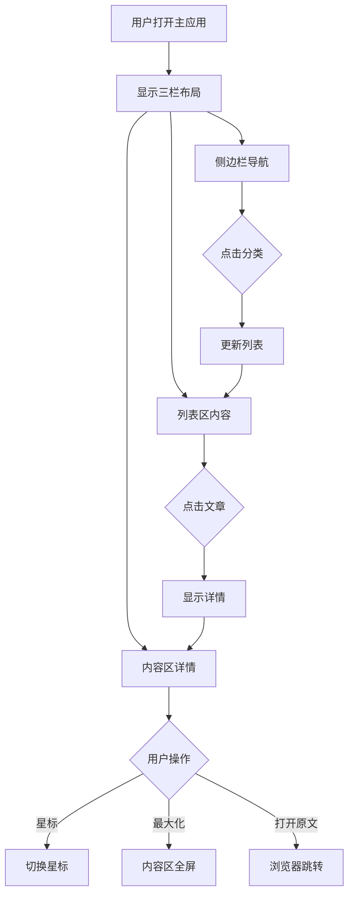
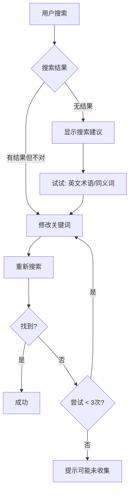
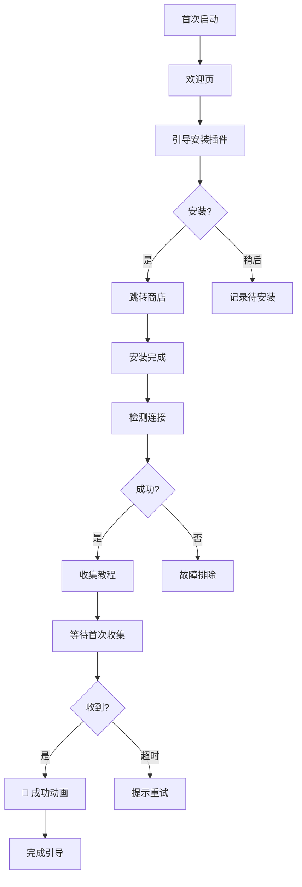

# UX Design Specification Memory Prosthetic

**Author:** Gao
**Date:** 2025-12-22

---

## Executive Summary

### Project Vision

**Memory Prosthetic（记忆外挂）** 是一款重新定义「信息检索」的桌面应用。

**核心定位**：想到即找到，看过不再忘。

与传统收藏工具不同，本产品以「检索记忆」为核心价值 —— 不是帮你收藏更多，而是帮你找到已经看过的。通过浏览器插件一键收集 + 语义搜索 + Spotlight 级快速唤起，解决现代知识工作者「我看过但找不到」的知识焦虑。

**技术特点**：

- 本地优先（Tauri + SQLite），数据隐私有保障
- 离线可用，无需依赖云端
- 本地 AI 语义搜索，支持模糊记忆检索

### Target Users

#### 主要用户：技术积累者

| 维度 | 描述 |
|------|------|
| 角色 | 全栈开发者 / 架构师 |
| 背景 | 3-8 年经验，持续学习，技术视野广 |
| 日常行为 | 每天阅读 5-15 篇技术文章 |
| 使用场景 | 技术选型、代码实现、技术讨论 |
| 痛点表达 | 「我记得之前看过一个很好的方案，但找不到在哪了」 |

#### 次要用户：知识焦虑者

| 维度 | 描述 |
|------|------|
| 角色 | 中高级开发者，想成长为架构师 |
| 背景 | 疯狂学习但留不住，收藏夹爆炸 |
| 痛点表达 | 「我每天都在学习，但感觉什么都没记住」 |

### Key Design Challenges

1. **极致响应速度** — 300ms 唤起是硬指标，任何可感知的延迟都会破坏 Spotlight 级体验
2. **模糊搜索信任** — 用户习惯精确匹配，需要通过 UX 引导建立对语义搜索的信任
3. **零阻力收集** — 收集动作必须比「加入书签」更简单，一键完成
4. **冷启动引导** — 新用户没有内容时如何快速体验到产品价值
5. **双端体验统一** — 浏览器插件与桌面应用需要一致的设计语言

### Design Opportunities

1. **「Aha!」时刻设计** — 首次模糊搜索成功时的惊喜体验是产品粘性的关键
2. **极简主义 UI** — 以搜索框为中心的 Spotlight 式设计，极简但不简陋
3. **本地优先信任感** — 强调数据完全在本地可以成为差异化优势
4. **渐进式复杂度** — MVP 极简，AI 增强功能作为后续惊喜而非必须

### Technical Constraints Driving UX

| 约束 | UX 影响 | 应对策略 |
|------|---------|----------|
| 300ms 唤起硬指标 | 不能有冷启动，不能有阻塞动画 | 搜索窗口预加载 + 非阻塞微动画 |
| Embedding 生成延迟 | 刚收集的内容可能搜不到 | 显示「索引中」状态 + Fallback 到标题匹配 |
| 插件依赖应用运行 | 应用未开时插件无法工作 | 清晰的状态提示 + 启动引导 |

### First-Time Experience Strategy

| 阶段 | 用户状态 | 设计策略 |
|------|----------|----------|
| 检测空库 | 没有任何收集内容 | 弹出欢迎引导，不是空白页面 |
| 引导安装 | 未检测到插件 | 提示安装 + 一键跳转 Chrome 商店 |
| 首次收集 | 完成第一次收集 | 庆祝动效 + 引导搜索 |
| 首次搜索 | 找到刚收集的内容 | 「Aha!」时刻强化 |

### UX Priority Matrix

| 优先级 | 设计决策 | 原因 |
|--------|----------|------|
| P0 | 搜索速度感知 | 定义产品的核心体验 |
| P0 | 首次成功体验 | 决定用户是否留下 |
| P1 | 搜索失败恢复 | 避免用户流失 |
| P2 | 情感化微设计 | 锦上添花 |

## Core User Experience

### Defining Experience

**核心体验公式**：

```
快捷键唤起 → 输入模糊词 → 看到结果 → 点击跳转
```

这个闭环是产品的灵魂。如果这 4 步做到极致，产品就成功了；如果任何一步有摩擦，产品就失败了。

**核心动作优先级**：

| 优先级 | 动作 | 体验目标 |
|--------|------|----------|
| P0 | 搜索唤起 + 输入 | < 300ms 响应，打字即搜索 |
| P0 | 结果展示 + 跳转 | < 500ms 返回，一键直达 |
| P1 | 浏览器收集 | < 2s 完成，静默成功 |
| P2 | 内容管理 | 简洁列表，快速删除 |

### Platform Strategy

| 维度 | 决策 | 原因 |
|------|------|------|
| **主平台** | macOS (Tauri) | 开发者首选，性能最优 |
| **交互模式** | 键盘优先 | 目标用户习惯，效率最高 |
| **辅助入口** | Chrome 插件 | 内容收集的必要触点 |
| **离线能力** | 完全离线 | 隐私、速度、可靠性 |
| **常驻模式** | 系统托盘 | 随时待命，无需启动 |

**利用的平台特性**：

- macOS 全局快捷键 — Spotlight 式唤起
- 系统托盘 — 后台常驻
- Login Items — 开机自启
- 无边框窗口 — 沉浸式搜索体验

### Effortless Interactions

| 交互 | 目标 | 实现策略 |
|------|------|----------|
| 搜索唤起 | 0.3s 响应 | 窗口预加载、全局快捷键 |
| 搜索输入 | 打字即搜索 | 实时搜索 + 200ms debounce |
| 内容收集 | 一键静默 | 无确认弹窗，仅 Toast |
| 结果跳转 | 点击即开 | 直接调用浏览器 |
| 关闭搜索 | Esc 即消失 | 无保存、无确认 |

**消除的竞品摩擦**：

- ❌ 打开应用 → ✅ 全局快捷键
- ❌ 导航到搜索 → ✅ 唤起即搜索
- ❌ 记住分类 → ✅ 语义搜索
- ❌ 多步操作 → ✅ 一键完成

### Critical Success Moments

| 时刻 | 用户心理 | 设计目标 |
|------|----------|----------|
| **首次模糊搜索成功** | 「这都能找到？！」 | Aha! 时刻，建立信任 |
| **快捷键秒速响应** | 「比 Spotlight 还快」 | 建立品质印象 |
| **收集后立即搜到** | 「真的有用」 | 强化即时价值 |
| **连续成功搜索** | 「靠谱」 | 形成使用习惯 |

**决定性成功场景**：
> 输入「后台管理」→ 出现 React Admin 文章 → 点击跳转 → 全程 < 3 秒

### Experience Principles

| # | 原则 | 指导意义 |
|---|------|----------|
| 1 | **速度即体验** | 300ms 是体验底线，不是技术指标 |
| 2 | **模糊即精确** | 语义搜索是产品魔法，必须可靠 |
| 3 | **收集如呼吸** | 零阻力，不打断用户心流 |
| 4 | **找到即结束** | 结果直达原文，无中间步骤 |
| 5 | **始终待命** | 常驻后台，快捷键随时可用 |

## Desired Emotional Response

### Primary Emotional Goals

| 情感 | 优先级 | 设计目标 |
|------|--------|----------|
| **掌控感** | P0 | 用户感觉记忆被增强，信息尽在指尖 |
| **惊喜感** | P0 | 模糊搜索成功时的「魔法」体验 |
| **安心感** | P1 | 本地存储、隐私保障带来的信任 |
| **效率感** | P1 | 3 秒完成从想到找到的全过程 |

**核心情感定位**：
> 用户应该感觉自己拥有了「第二大脑」—— 不是在使用一个 App，而是能力被增强了。

### Emotional Journey Mapping

| 阶段 | 用户状态 | 目标情感 | 设计策略 |
|------|----------|----------|----------|
| 发现产品 | 初次听说 | 好奇 → 期待 | 「记忆外挂」定位差异化 |
| 首次安装 | 设置过程 | 简单 → 安心 | 极简 onboarding |
| 首次收集 | 试用插件 | 顺畅 → 满意 | 一键成功，即时反馈 |
| 首次搜索 | 验证价值 | **惊喜 → 信任** | Aha! 时刻设计 |
| 日常使用 | 形成习惯 | 高效 → 依赖 | 稳定可靠 |
| 搜索失败 | 遇到挫折 | 不沮丧 → 被引导 | 建议替代词 |
| 长期积累 | 内容丰富 | 富足 → 掌控 | 成就可视化 |

### Micro-Emotions

**关键微情感对**：

| 追求 | 避免 | 触发场景 | 设计策略 |
|------|------|----------|----------|
| 自信 | 困惑 | 输入搜索 | 提示词、搜索建议 |
| 信任 | 怀疑 | 等待结果 | 显示匹配原因 |
| 愉悦 | 焦虑 | 加载过程 | 渐进加载、微动画 |
| 成就 | 挫败 | 搜索结果 | 成功强化、失败引导 |
| 专注 | 分心 | 全过程 | 极简无干扰 |

### Design Implications

**情感 → 设计转化**：

| 情感目标 | UX 实现 |
|----------|---------|
| 掌控感 | 全局快捷键 + 托盘常驻 + 键盘全支持 |
| 惊喜感 | 首次成功微动画 + 匹配词高亮 |
| 安心感 | 「本地存储」标识 + 离线可用 |
| 效率感 | 响应时间展示 + 渐进加载 |
| 信任感 | 匹配原因展示 + 相关度提示 |

**负面情感预防**：

| 避免情感 | 触发场景 | 预防设计 |
|----------|----------|----------|
| 焦虑 | 不知应用状态 | 托盘状态明确 |
| 挫败 | 搜索无结果 | 引导换词、显示最近 |
| 困惑 | 不知如何开始 | 空状态引导 |
| 怀疑 | 收集是否成功 | 明确 Toast 反馈 |

### Emotional Design Principles

| # | 原则 | 指导意义 |
|---|------|----------|
| 1 | **增强而非取代** | 产品是能力增强，不是工具 |
| 2 | **魔法需要证明** | 语义搜索需要 UX 建立信任 |
| 3 | **失败也是体验** | 无结果时引导，不是死路 |
| 4 | **极简即尊重** | 简洁表达对用户时间的尊重 |
| 5 | **本地即安心** | 隐私保护是情感价值 |

## UX Pattern Analysis & Inspiration

### Inspiring Products Analysis

| 产品 | 相关维度 | 核心学习 |
|------|----------|----------|
| **Raycast** | 搜索浮窗交互 | 输入即搜索、键盘全导航、空结果引导 |
| **Spotlight** | 原生体验 | 速度标准、毛玻璃视觉 |
| **Cubox** | 内容管理 | 三栏布局、温暖深色、阅读体验 |
| **Arc Browser** | 视觉创新 | 现代视觉语言、微妙细节 |

**Cubox 深度分析**（主应用灵感来源）：

- 三栏布局：侧边栏导航 + 文章列表 + 阅读区
- 温暖深色主题：护眼且有质感
- 彩色图标：粉红（解读）、黄色（星标）、红色（今天）
- 可折叠分组：智能列表、收藏夹、标签
- 数量徽章：每个分类显示内容数量

### Dual-Mode Interaction Pattern

**双模式设计决策**：

| 模式 | 功能定位 | 设计语言 |
|------|----------|----------|
| **搜索浮窗** | 快速搜索 + 预览 | Spotlight/Raycast 式极简 |
| **主应用** | 内容浏览 + 阅读 + 管理 | Cubox 式三栏布局 |

**交互连接**：

```
搜索浮窗 → 点击结果 → 打开主应用 → 定位到该文章
```

**搜索浮窗 (Spotlight 式)**：

- 全局快捷键唤起
- 无边框、毛玻璃、always-on-top
- 输入即搜索、渐进加载结果
- 每条结果显示：标题 + 简介 + 来源 + 时间
- 点击跳转主应用、Cmd+Enter 跳转原文

**主应用 (Cubox 式)**：

- 三栏布局：侧边栏 | 列表 | 阅读区
- 温暖深色主题
- 侧边栏：全部、星标、标签（MVP 简化）
- 列表区：时间排序、搜索过滤
- 阅读区：沉浸式内容展示

### Transferable UX Patterns

**搜索浮窗模式**：

| 模式 | 来源 | 应用 |
|------|------|------|
| 输入即搜索 | Raycast | 实时过滤 |
| 简介预览 | Raycast | 标题+摘要+来源 |
| 毛玻璃背景 | Spotlight | macOS 融合 |
| 键盘导航 | Raycast | ↑↓ 选择 |

**主应用模式**：

| 模式 | 来源 | 应用 |
|------|------|------|
| 三栏布局 | Cubox | 侧边栏+列表+阅读 |
| 温暖深色 | Cubox | 护眼配色 |
| 彩色图标 | Cubox | 分类识别 |
| 折叠分组 | Cubox | 减少负担 |

### Anti-Patterns to Avoid

| 反模式 | 避免原因 |
|--------|----------|
| 搜索浮窗过于复杂 | 保持极简，复杂功能放主应用 |
| 主应用层级过深 | MVP 简化，避免 Notion 式复杂 |
| 两种模式风格割裂 | 保持统一的配色和设计语言 |
| 强制阅读器 | 可选跳转原文或应用内阅读 |

### Design Inspiration Strategy

**搜索浮窗**：

- 采纳 Raycast 交互模式
- 采纳 Spotlight 视觉风格
- 新增：简介预览卡片

**主应用**：

- 采纳 Cubox 三栏布局
- 采纳 Cubox 温暖深色主题
- 简化 Cubox 导航层级（MVP）

**统一元素**：

- 相同的配色体系
- 相同的圆角和阴影
- 相同的字体层级

## Design System Foundation

### Design System Choice

**选择：shadcn/ui + Tailwind CSS（已集成）**

基于以下考量：

- 项目已集成 53 个 shadcn/ui 组件
- 完全可控的代码所有权
- Tailwind 原生，定制灵活
- Radix UI 基础，无障碍性优秀

### Rationale for Selection

| 考量维度 | shadcn/ui 优势 |
|----------|---------------|
| **定制灵活性** | 组件代码完全可控，可深度修改 |
| **双模式支持** | 可为搜索浮窗和主应用分别定制 |
| **品牌一致性** | CSS 变量系统易于统一配色 |
| **开发效率** | 已集成，无迁移成本 |
| **长期维护** | 无外部依赖，升级自主可控 |

### Implementation Approach

**主题层次**：

| 层次 | 内容 |
|------|------|
| **基础层** | Tailwind 扩展配色、间距、圆角 |
| **变量层** | CSS 变量定义温暖深色主题 |
| **组件层** | shadcn/ui 组件定制 |
| **应用层** | 双模式特定样式 |

**温暖深色主题**：

- 背景：微暖黑（#0d0d0d → #1a1816）
- 卡片：温暖灰（#252320）
- 强调色：粉红、黄色、红色（参考 Cubox）

### Customization Strategy

**搜索浮窗定制**：

- 基于 Command 组件
- 添加毛玻璃背景效果
- 简介预览卡片
- 键盘导航增强

**主应用定制**：

- 三栏布局系统
- Cubox 式侧边栏
- 虚拟滚动列表
- 沉浸式阅读区

**共享设计语言**：

- 统一配色变量
- 统一圆角（8px 小、12px 中、16px 大）
- 统一阴影层次
- 统一字体层级

### Component Inventory

| 分类 | 组件 | 来源 | 定制程度 |
|------|------|------|----------|
| 搜索 | SearchCommand | shadcn Command | 高度定制 |
| 导航 | AppSidebar | shadcn Sidebar | 中度定制 |
| 列表 | ArticleCard | 自建 | 全新 |
| 阅读 | ArticleReader | 自建 | 全新 |
| 反馈 | Toast | shadcn Toast | 轻度定制 |
| 对话 | Dialog | shadcn Dialog | 原样使用 |
| 按钮 | Button | shadcn Button | 配色调整 |
| 输入 | Input | shadcn Input | 配色调整 |

## Defining Core Experience

### The Defining Experience

**一句话定义**：
> 「输入模糊记忆，秒找到那篇文章」

**用户描述**：
> 「我有个工具，输入'后台管理'就能找到我之前看过的 React Admin 文章，0.5 秒就出来了。」

**核心价值**：

- 搜索不是入口，搜索就是产品
- 用户不需要「管理」，只需要「找到」
- 速度和准确率定义一切

### User Mental Model

**现有方案痛点**：

| 方案 | 行为 | 痛点 |
|------|------|------|
| 浏览器书签 | 导航层级 | 记不住分类 |
| Notion 搜索 | 多步操作 | 启动慢、结果杂 |
| Google 重搜 | 重新搜索 | 找不到原文 |

**期望的心智模型**：

```
记得看过 → 快捷键 → 输入印象 → 找到 → 完事
```

### Success Criteria

| 维度 | 成功标准 |
|------|----------|
| 速度感知 | 用户感觉「秒出结果」 |
| 搜索有效性 | 80% 搜索找到目标 |
| 信任建立 | 用户相信模糊也能找到 |
| 习惯形成 | 遇事先按快捷键 |

### Novel UX Patterns

| 层面 | 模式 | 策略 |
|------|------|------|
| 唤起方式 | 成熟 | 复用 Spotlight 习惯 |
| 搜索交互 | 成熟 | 输入即搜索 |
| 语义搜索 | 创新 | 首次成功强化信任 |
| 双模式跳转 | 轻创新 | 提供两种选项 |

### Experience Mechanics

**搜索浮窗键盘映射**：

| 按键 | 行为 |
|------|------|
| `Cmd+Shift+Space` | 唤起/隐藏 |
| `↑` `↓` | 导航结果 |
| `Enter` | 打开主应用 |
| `Cmd+Enter` | 跳转原文 |
| `Esc` | 关闭 |

**主应用键盘映射**：

| 按键 | 行为 |
|------|------|
| `Cmd+O` | 打开原文 |
| `Cmd+D` | 删除 |
| `Cmd+S` | 星标 |
| `Cmd+F` | 聚焦搜索 |

**双模式连接**：

- 搜索浮窗点击 → 打开主应用 → 定位到该文章
- 主应用内搜索 → 同样的搜索体验
- 统一的配色和交互语言

## Visual Design Foundation

### Color System

**色彩策略**：温暖深色主题（Cubox 灵感）

**基础色板**：

| 语义 | 色值 | 用途 |
|------|------|------|
| Background | #141211 | 主背景 |
| Card | #1c1a18 | 卡片/面板 |
| Muted | #252320 | 次级背景 |
| Border | #3a3735 | 边框 |
| Text Primary | #f5f5f4 | 主文字 |
| Text Secondary | #a8a29e | 次文字 |
| Text Muted | #78716c | 弱化文字 |

**强调色**：

| 语义 | 色值 | 场景 |
|------|------|------|
| Primary | #e879a2 | 粉红，主操作 |
| Secondary | #f59e0b | 黄色，星标 |
| Destructive | #ef4444 | 红色，删除 |
| Success | #22c55e | 绿色，成功 |
| Info | #3b82f6 | 蓝色，链接 |

**搜索浮窗**：

- 背景：rgba(20, 18, 17, 0.85) + backdrop-blur
- 边框：1px solid rgba(255, 255, 255, 0.1)
- 阴影：0 25px 50px -12px rgba(0, 0, 0, 0.5)

### Typography System

**字体选择**：

- UI 文字：Inter / system-ui
- 中文：system-ui / PingFang SC
- 代码：JetBrains Mono

**字体层级**：

| 级别 | 大小 | 权重 | 用途 |
|------|------|------|------|
| Display | 36px | 700 | 大标题 |
| H1 | 24px | 600 | 页面标题 |
| H2 | 20px | 600 | 区块标题 |
| H3 | 16px | 600 | 小标题 |
| Body | 14px | 400 | 正文 |
| Small | 12px | 400 | 辅助文字 |
| Tiny | 11px | 400 | 元信息 |

### Spacing & Layout Foundation

**间距系统**（8px 基础）：

- space-1: 4px（紧凑）
- space-2: 8px（元素内部）
- space-3: 12px（相关元素）
- space-4: 16px（区块间）
- space-5: 24px（大区块）
- space-6: 32px（页面级）

**圆角系统**：

- radius-sm: 6px（按钮）
- radius-md: 8px（卡片）
- radius-lg: 12px（模态框）
- radius-xl: 16px（搜索浮窗）

**三栏布局**：

- 侧边栏：200px（固定）
- 列表区：280px（固定）
- 内容区：flex: 1（自适应）

### Accessibility Considerations

| 维度 | 标准 | 实现 |
|------|------|------|
| 对比度 | WCAG AA | 4.5:1 最小 |
| 焦点指示 | 清晰可见 | 2px 色环 |
| 键盘导航 | 完全支持 | 所有操作 |
| 字体最小 | 11px | 不低于 |
| 触摸目标 | 44px | 最小点击区 |

## Design Direction Decision

### Design Directions Explored

探索了 4 个主要设计方向：

| 方向 | 名称 | 核心特点 |
|------|------|----------|
| A | Classic Cubox | 三栏经典布局，固定侧边栏 |
| B | Minimal Reader | 极简阅读体验，图标导航 |
| C | Dense Dashboard | 卡片网格，高信息密度 |
| D | Hybrid Flow | 智能分组，可切换视图 |

### Chosen Direction

**Combined (A+B+D 融合版)** — 结合三个方向的优点：

- **Cubox 三栏布局**（方向 A）：侧边栏 + 列表区 + 内容区
- **极简阅读模式**（方向 B）：可折叠侧边栏 + 内容区最大化
- **智能分组**（方向 D）：按时间分组（今天/本周/更早）

### Key Design Features

**1. 可折叠侧边栏（三态切换）**

| 状态 | 宽度 | 内容 | 快捷键 |
|------|------|------|--------|
| 展开 | 220px | 完整导航 + 计数 | ⌘\ |
| 折叠 | 56px | 仅图标 + 悬停提示 | ⌘\ |
| 隐藏 | 0px | 完全隐藏 | ⌘\ |

**2. 内容区最大化**

| 操作 | 效果 | 快捷键 |
|------|------|--------|
| 点击按钮 | 内容区覆盖全屏 | ⌘M |
| 再次点击 | 恢复正常布局 | ESC |

**3. 键盘快捷键**

| 快捷键 | 功能 |
|--------|------|
| `⌘K` | 打开搜索浮窗 |
| `⌘\` | 切换侧边栏状态 |
| `⌘M` | 最大化/还原内容区 |
| `ESC` | 关闭浮窗/退出最大化 |

### Design Rationale

1. **灵活性**：用户可根据场景调整布局密度
2. **专注力**：最大化模式支持深度阅读
3. **效率**：键盘快捷键加速常用操作
4. **一致性**：保持 Cubox 视觉风格的温暖深色调

### Implementation Approach

```
┌─────────────────────────────────────────────────────────────┐
│  侧边栏 (220px/56px/0)  │  列表区 (320px)  │  内容区 (flex)  │
│  ┌─────────────────┐    │  ┌─────────────┐  │  ┌───────────┐ │
│  │ 🧠 Memory       │    │  │ 今天        │  │  │ 文章标题  │ │
│  │ ────────────── │    │  │ └─ 文章 1   │  │  │           │ │
│  │ 📦 全部   128   │    │  │ └─ 文章 2   │  │  │ 正文内容  │ │
│  │ ⭐ 星标   24    │    │  │ 本周        │  │  │ ...       │ │
│  │ 🕐 稍后   12    │    │  │ └─ 文章 3   │  │  │           │ │
│  │ ────────────── │    │  │ └─ 文章 4   │  │  │      [⛶]  │ ← 最大化按钮
│  │ 🏷️ 标签        │    │  │ 更早        │  │  └───────────┘ │
│  │ 📁 文件夹      │    │  │ └─ ...      │  │                │
│  │ [◀] ← 折叠按钮 │    │  └─────────────┘  │                │
│  └─────────────────┘    │                   │                │
└─────────────────────────────────────────────────────────────┘
```

### Visual Reference

设计方向交互原型：`docs/ux-design-directions.html`

## User Journey Flows

### Flow 1: 内容收集流程

**场景**：用户在浏览器中发现有价值的文章，想要收集。

```mermaid
flowchart TD
    A[用户浏览网页] --> B{发现有价值内容}
    B -->|点击插件图标| C[弹出收集面板]
    B -->|快捷键 Cmd+Shift+S| C
    C --> D[显示文章标题/URL预览]
    D --> E{确认收集?}
    E -->|点击确认| F[发送到桌面应用]
    E -->|点击取消| G[关闭面板]
    F --> H{桌面应用运行中?}
    H -->|是| I[保存到本地数据库]
    H -->|否| J[显示"请启动桌面应用"]
    I --> K[生成向量 embedding]
    K --> L[显示"已收集"成功提示]
    L --> M[1秒后自动关闭]
```

**关键指标**：弹出 < 100ms，收集确认 1 次点击，成功反馈 < 500ms

### Flow 2: 语义搜索流程

**场景**：用户需要找到之前收集的内容。

```mermaid
flowchart TD
    A[用户有搜索需求] --> B{唤起搜索}
    B -->|全局快捷键 Cmd+Space| C[显示搜索浮窗]
    B -->|点击托盘图标| C
    C --> D[搜索框获得焦点]
    D --> E[用户输入关键词]
    E --> F{输入 > 2 字符?}
    F -->|否| G[显示最近收集]
    F -->|是| H[执行语义搜索]
    H --> I{有结果?}
    I -->|是| J[显示结果列表]
    I -->|否| K[显示"未找到"建议]
    J --> L{用户选择}
    L -->|Enter| M[在主应用打开]
    L -->|Cmd+Enter| N[预览摘要]
    L -->|Shift+Enter| O[在浏览器打开原文]
```

**关键指标**：唤起 < 200ms，搜索响应 < 500ms

### Flow 3: 阅读与管理流程

**场景**：用户在主应用中阅读和管理内容。



### Flow 4: 搜索失败恢复流程

**场景**：用户搜索但没找到想要的结果。



**失败恢复策略**：第一次失败建议换同义词，第二次建议用英文，第三次提示可能未收集

### Flow 5: 首次使用流程

**场景**：新用户首次启动应用。



### Journey Patterns

| 模式 | 描述 | 应用场景 |
|------|------|----------|
| **快速确认** | 单击确认 + 自动关闭 | 收集流程 |
| **即时反馈** | 操作后立即显示结果 | 搜索、收集 |
| **渐进引导** | 分步骤教学 | 首次使用 |
| **优雅降级** | 失败时提供建议 | 搜索失败 |
| **键盘优先** | 全程支持键盘操作 | 搜索、导航 |

### Flow Optimization Principles

1. **最短路径** — 收集只需 1 步，搜索即时响应
2. **明确反馈** — 每个操作都有视觉确认
3. **容错设计** — 失败时引导而非阻塞
4. **渐进披露** — 初始简洁，按需展开
5. **一致性** — 相同操作相同结果

## Component Strategy

### Design System Components

基于 **shadcn/ui + Tailwind CSS**，以下组件可直接使用：

| 类别 | 组件 | 用途 |
|------|------|------|
| 输入 | Input, Textarea, Select | 搜索、表单 |
| 按钮 | Button, Toggle | 操作触发 |
| 导航 | Tabs, Breadcrumb | 页面导航 |
| 布局 | Card, ScrollArea, Separator | 内容容器 |
| 反馈 | Toast, Dialog, Popover | 状态提示 |
| 数据 | Badge, Avatar | 数据展示 |

### Custom Components

#### 1. SearchOverlay（搜索浮窗）

| 属性 | 规格 |
|------|------|
| 尺寸 | 620px 宽，最大高度 520px |
| 位置 | 屏幕顶部居中，距顶 100px |
| 背景 | rgba(28, 26, 24, 0.98) + backdrop-blur |
| 圆角 | 16px |

**子组件**：SearchInput, SearchResults, SearchResultItem, SearchFooter

**状态**：idle（最近收集）, searching（loading）, results（结果）, empty（空状态）

#### 2. CollapsibleSidebar（可折叠侧边栏）

| 状态 | 宽度 | 内容 |
|------|------|------|
| expanded | 220px | 完整导航 |
| collapsed | 56px | 仅图标 |
| hidden | 0px | 完全隐藏 |

**子组件**：SidebarHeader, SidebarNav, SidebarNavItem, SidebarSection

#### 3. ArticleList（文章列表）

| 属性 | 规格 |
|------|------|
| 宽度 | 320px 固定 |
| 分组 | 按时间（今天/本周/更早） |

**子组件**：ListToolbar, ListGroup, ListItem

#### 4. ArticleReader（文章阅读器）

| 属性 | 规格 |
|------|------|
| 宽度 | flex: 1，内容最大 720px |
| 状态 | normal / maximized |

**子组件**：ReaderToolbar, ReaderHeader, ReaderBody, MaximizeButton

#### 5. CollectPopup（收集弹窗）

| 属性 | 规格 |
|------|------|
| 尺寸 | 320px 宽 |
| 位置 | 浏览器右上角 |

**状态**：idle, collecting, success, error

### Component Implementation Strategy

| 策略 | 说明 |
|------|------|
| 基于 shadcn/ui | 使用其基础组件构建 |
| 设计令牌 | CSS 变量保持一致性 |
| 组合模式 | 自定义组件由基础组件组合 |
| 状态管理 | React hooks |
| 动画 | CSS transition + Tailwind |

### Implementation Roadmap

**Phase 1 — 核心（MVP）**

| 组件 | 优先级 |
|------|--------|
| SearchOverlay | P0 |
| CollectPopup | P0 |
| ArticleList | P0 |
| ArticleReader | P0 |

**Phase 2 — 增强**

| 组件 | 优先级 |
|------|--------|
| CollapsibleSidebar | P1 |
| OnboardingWizard | P1 |

**Phase 3 — 优化**

| 组件 | 优先级 |
|------|--------|
| EmptyState | P2 |
| SearchSuggestions | P2 |

## UX Consistency Patterns

### Button Hierarchy

| 层级 | 样式 | 用途 |
|------|------|------|
| Primary | 实心粉红 #e879a2 | 主要操作（收集、保存） |
| Secondary | 描边/透明 | 次要操作（取消、返回） |
| Ghost | 纯文字/图标 | 辅助操作（星标、分享） |
| Destructive | 红色 #ef4444 | 危险操作（删除） |

**按钮状态**：Default → Hover (+10% 亮度) → Active (-10%) → Disabled (50% 透明) → Loading (spinner)

### Feedback Patterns

| 类型 | 颜色 | 持续时间 | 场景 |
|------|------|----------|------|
| Success | #22c55e | 2s 自动消失 | 收集成功 |
| Error | #ef4444 | 手动关闭 | 收集失败 |
| Warning | #f59e0b | 5s 或手动 | 连接断开 |
| Info | #3b82f6 | 3s 自动 | 提示信息 |

**Toast 位置**：右下角，距边 24px

### Search Patterns

| 场景 | 行为 |
|------|------|
| 唤起 | ⌘Space，< 200ms 响应 |
| 输入 | 实时搜索，debounce 150ms |
| 导航 | ↑↓ 键盘，Enter 打开 |
| 无结果 | 显示建议 |
| 关闭 | ESC / 点击遮罩 |

**高亮**：匹配文字用 #e879a2

### Navigation Patterns

| 模式 | 行为 |
|------|------|
| 侧边栏 | 点击切换，active 高亮 |
| 列表 | 点击选中，左边框指示 |
| 面包屑 | 显示位置，可点击返回 |
| 键盘 | Tab 焦点，Enter 确认 |

**焦点指示**：2px 粉红色环，offset 2px

### Loading Patterns

| 场景 | 样式 |
|------|------|
| 搜索中 | 输入框内 spinner |
| 收集中 | 按钮内 spinner |
| 页面加载 | 骨架屏脉冲 |

### Empty States

| 场景 | 内容 |
|------|------|
| 首次使用 | 欢迎语 + 安装插件引导 |
| 无收藏 | 插图 + 开始收集按钮 |
| 搜索无结果 | 修改关键词建议 |

### Modal Patterns

| 类型 | 尺寸 | 关闭方式 |
|------|------|----------|
| 搜索浮窗 | 620px | ESC / 遮罩 |
| 确认对话框 | 400px | 按钮 |

**遮罩**：rgba(0,0,0,0.6) + blur(8px)
**动画**：fade 0.15s + scale 0.95→1

### Keyboard Shortcuts

| 快捷键 | 功能 | 范围 |
|--------|------|------|
| ⌘K / ⌘Space | 搜索 | 全局 |
| ⌘\ | 切换侧边栏 | 应用内 |
| ⌘M | 最大化阅读 | 应用内 |
| ESC | 关闭/取消 | 通用 |
| ↑↓ | 列表导航 | 焦点内 |

### Consistency Checklist

| 维度 | 规则 |
|------|------|
| 颜色 | 使用设计令牌 |
| 间距 | 4px 倍数系统 |
| 动画 | 0.15s-0.25s ease |
| 圆角 | 按组件类型规定 |
| 焦点 | 所有可交互元素 |

## Responsive Design & Accessibility

### Responsive Strategy

**平台定位**：桌面优先（Tauri + 浏览器插件）

| 平台 | 优先级 |
|------|--------|
| 桌面 | P0 |
| 浏览器插件 | P0 |
| 平板 | P2 |
| 手机 | P3 |

**桌面响应式**：

| 窗口宽度 | 布局 |
|----------|------|
| ≥1200px | 三栏完整 |
| 900-1199px | 侧边栏可折叠 |
| 600-899px | 双栏 |
| <600px | 单栏切换 |

### Breakpoint Strategy

| 断点 | 宽度 | 用途 |
|------|------|------|
| sm | 640px | 最小双栏 |
| md | 768px | 标准双栏 |
| lg | 1024px | 三栏开始 |
| xl | 1280px | 完整三栏 |

### Accessibility Strategy

**目标**：WCAG 2.1 AA 级别

| 维度 | 标准 |
|------|------|
| 对比度 | 4.5:1 文字 |
| 键盘导航 | 全功能支持 |
| 焦点指示 | 2px 粉红环 |
| 触摸目标 | ≥44px |
| 动画 | 支持 reduced-motion |

**键盘导航**：

| 按键 | 功能 |
|------|------|
| Tab | 焦点前进 |
| Shift+Tab | 焦点后退 |
| Enter | 激活 |
| ESC | 关闭 |

**ARIA 标签**：

| 组件 | ARIA |
|------|------|
| 搜索框 | role="search" |
| 侧边栏 | role="navigation" |
| 弹窗 | role="dialog" aria-modal |
| Toast | role="alert" |

### Testing Strategy

| 测试类型 | 工具 |
|----------|------|
| 自动扫描 | axe DevTools |
| 键盘测试 | 手动 Tab |
| 屏幕阅读器 | VoiceOver |
| 对比度 | Colour Contrast Analyser |

### Implementation Guidelines

**响应式开发**：

- 使用相对单位（rem, %, vw）
- 移动优先媒体查询
- 测试触摸目标

**无障碍开发**：

- 语义化 HTML
- ARIA 标签
- 焦点管理
- prefers-reduced-motion 支持

## Responsive Design & Accessibility

### Responsive Strategy

**平台定位**：桌面优先（Tauri + 浏览器插件）

| 平台 | 优先级 | 说明 |
|------|--------|------|
| 桌面 | P0 | macOS/Windows/Linux |
| 浏览器插件 | P0 | Chrome 固定尺寸弹窗 |
| 平板 | P2 | 未来考虑 |
| 手机 | P3 | 暂不支持 |

**桌面布局适应**：

| 窗口宽度 | 布局 |
|----------|------|
| ≥1024px | 三栏完整 |
| 768-1023px | 侧边栏折叠 |
| <768px | 单栏切换 |

### Breakpoint Strategy

| 断点 | 宽度 | 布局 |
|------|------|------|
| lg | 1024px | 三栏开始 |
| md | 768px | 双栏 |
| sm | 640px | 单栏 |

### Accessibility Strategy

**目标**：WCAG 2.1 AA 级别

| 维度 | 标准 | 实现 |
|------|------|------|
| 对比度 | 4.5:1 文字 | 深色主题满足 |
| 键盘 | 全功能 | Tab/Enter/ESC |
| 焦点 | 清晰可见 | 2px 粉红环 |
| 屏幕阅读器 | ARIA | 语义化 HTML |
| 触摸目标 | ≥44px | 按钮/链接 |
| 动画 | 可禁用 | prefers-reduced-motion |

**键盘导航**：Tab 前进、Shift+Tab 后退、Enter 确认、ESC 关闭、↑↓ 列表

**ARIA 要求**：搜索框 role="search"、侧边栏 role="navigation"、弹窗 role="dialog" aria-modal="true"

### Testing Strategy

| 类型 | 工具 |
|------|------|
| 响应式 | DevTools, 真机测试 |
| 自动扫描 | axe, Lighthouse |
| 键盘 | 手动 Tab 测试 |
| 屏幕阅读器 | VoiceOver |

---

## Workflow Completion

**UX 设计规范完成时间**：2025-12-22

**核心交付物**：

- ✅ UX 设计规范：`docs/ux-design-specification.md`
- ✅ 设计方向原型：`docs/ux-design-directions.html`
